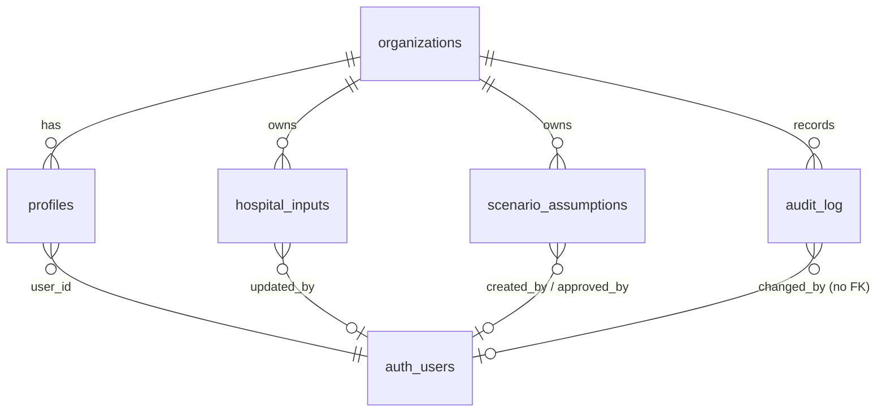

# Database Schema (Supabase Postgres)

Status: **implemented.** The source of truth is `supabase/migrations/`: `20261008000000_init.sql` (Phase 1 schema, RLS and triggers), `20261008000100_reference_data.sql` (reference data), `20261008100000_multi_hospital.sql` (multi-hospital platform, §8–§12) , `20261008100100_workbook_templates.sql` (workbook model template) and `20261008100200_view_privileges.sql` (explicit view grants). This document explains the design. Behaviour is verified through the real Supabase Auth + Data API by `supabase/tests/rls.test.ts` and `supabase/tests/hospitals.test.ts`.

§1–§6 describe the Phase 1 tables (the Workbook Value Model); since the multi-hospital migration they are scoped by `hospital_id` as well as `organization_id`.

Design rules:

- **Phase 1 started with five tables** (`organizations`, `profiles`, `hospital_inputs`, `scenario_assumptions`, `audit_log`); the multi-hospital platform adds the tables in §8.
- **`NULL` means unknown; `0` means zero.** Never default a hospital value to 0.
- **Calculations are not stored.** They are recomputed from inputs by `src/domain`. The one exception is an approval snapshot, which freezes an approved scenario's figures.
- **Every row carries `organization_id`**, and hospital data also carries `hospital_id`; RLS is hospital-level (§11).
- **No patient-level data.** No table or column may hold patient-identifiable information.
- **RLS on every table, deny by default.** The audit log is written only by triggers.

## 1. Entity overview



## 2. Enums

| Enum | Values | Notes |
|---|---|---|
| `app_role` | `admin`, `manager`, `viewer`, `referring_physician`, `patient` | The last two are **reserved**. No RLS policy grants them anything. |
| `input_source_type` | `hospital_data`, `verified_public`, `rg_assumption` | Workbook legend: yellow = hospital data, blue = RG assumption. ICU beds = `verified_public`. |
| `savings_level` | `low`, `mid`, `high` | Workbook `Low` / `Mid` / `High` |
| `scenario_status` | `draft`, `approved`, `archived` | Admin-only approval |

## 3. Tables

### `organizations`

| Column | Type | Constraints |
|---|---|---|
| id | uuid | PK, `gen_random_uuid()` |
| name | text | not null |
| created_at | timestamptz | not null, default `now()` |

### `profiles`

One row per platform user, linked to Supabase `auth.users`.

| Column | Type | Constraints |
|---|---|---|
| id | uuid | PK |
| user_id | uuid | not null, unique, FK `auth.users(id)` |
| organization_id | uuid | not null, FK `organizations` |
| full_name | text | not null |
| role | `app_role` | not null, default `viewer` |
| active | boolean | not null, default `true` |
| created_at / updated_at | timestamptz | not null |

Users are **deactivated, never deleted**: `active = false` revokes all access through the RLS helper functions. This keeps audit attribution intact.

### `hospital_inputs`

Key–value store for every hospital input **and** every global Respiratory Gate model assumption. There is one row per `(organization_id, key)`. Keys, labels, units, groups, owners and notes come from the TypeScript input catalog (`src/domain/inputs/catalog.ts`), which is canonical. The seed is generated from it.

| Column | Type | Constraints / meaning |
|---|---|---|
| id | uuid | PK |
| organization_id | uuid | not null, FK |
| key | text | not null; catalog key, e.g. `ventilated_patient_days` |
| category | text | not null; one of `icu_activity`, `unit_costs`, `annual_spend`, `usage`, `equipment`, `billing`, `other_revenue`, `operating_cost`, `model_assumptions` |
| label | text | not null (copied from catalog for audit and report readability) |
| unit | text | not null, e.g. `EGP / yr`, `%`, `patient-days / yr` |
| numeric_value | numeric | **nullable: `NULL` = not yet provided**; ≥ 0; fractions for `%` (≤ 1) |
| text_value | text | nullable qualifier, e.g. the oxygen consumption unit (`m³`) or a source note. Never patient data. |
| data_owner | text | e.g. `Finance`, `Biomedical` |
| note | text | catalog note (workbook column E) |
| source_type | `input_source_type` | not null |
| updated_by | uuid | FK `auth.users`; stamped by trigger |
| updated_at | timestamptz | stamped by trigger |

Unique `(organization_id, key)`.

**Rows seeded per organisation (55):**

- 46 hospital inputs, every yellow cell (`docs/excel-formula-map.md` §3 and §5). All `NULL` except `icu_beds = 50` (`verified_public`, source: Elite Hospital website, 6 Oct 2026).
- 9 `model_assumptions` rows (`rg_assumption`):

  | Key | Default |
  |---|---|
  | `days_per_month` | 30 |
  | `days_per_year` | 365 |
  | `occupancy_scenario_1` … `occupancy_scenario_4` | 0.6, 0.7, 0.8, 0.9 |
  | `price_scenario_1` … `price_scenario_3` | 800, 1,000, 1,200 |

**Addition vs `CLAUDE.md`:** none. The global grids and day counts are stored here as `rg_assumption` rows rather than in a new table. That gives them the same audit trail as hospital inputs.

### `scenario_assumptions`

Named scenario selections plus their savings sensitivities.

| Column | Type | Constraints / meaning |
|---|---|---|
| id | uuid | PK |
| organization_id | uuid | not null, FK |
| scenario_name | text | not null; unique per organisation |
| occupancy_rate | numeric(6,5) | not null, 0 < x ≤ 1 |
| package_price | numeric(12,2) | not null, > 0 (EGP per occupied ICU respiratory patient-day) |
| savings_level | `savings_level` | not null, default `mid` |
| low_savings_pct / mid_savings_pct / high_savings_pct | numeric(6,5) | not null, 0 ≤ x ≤ 1; defaults 0.05 / 0.10 / 0.15 |
| is_default | boolean | not null, default false; **at most one per organisation** (partial unique index). Supplies the default selection and the official sensitivities. |
| status | `scenario_status` | not null, default `draft` |
| approved_by / approved_at | uuid / timestamptz | set by trigger when status becomes `approved` (Admin only) |
| approved_snapshot | jsonb | the inputs, assumptions and `ModelResult` at approval time, so approved figures cannot drift silently |
| created_by / created_at / updated_at | uuid / timestamptz | |

Seeded row: `Workbook default`: 0.8 / 1000 / `mid` / 0.05 / 0.10 / 0.15, `is_default = true`, `status = draft`.

**Additions vs `CLAUDE.md`:** `is_default`, `status`, `approved_by`, `approved_at`, `approved_snapshot`. These implement the "save/approve scenarios" Admin capability without a new table.

### `audit_log`

Append-only change history. It is written **only** by database triggers, so no application code path can skip it.

| Column | Type | Meaning |
|---|---|---|
| id | bigint identity | PK |
| organization_id | uuid | not null |
| entity_type | text | `hospital_input`, `scenario_assumption` or `profile` |
| entity_id | uuid | row id |
| field_name | text | the **input key** for `hospital_input` (`oxygen_spend`; `oxygen_consumption.text` for `text_value`); the column name for the other entities |
| old_value / new_value | text | previous / new value (`NULL` = blank) |
| changed_by | uuid | `auth.uid()` of the person who made the change (`NULL` for system changes). **No foreign key**, so history survives removal of an account |
| actor_name | text | the person's name captured at write time (`System` for migrations or service-role changes) |
| changed_at | timestamptz | default `now()` |
| action | text | `insert`, `update` or `delete` |

`entity_type` also accepts `organization` (organisation renames).

**Additions vs `CLAUDE.md`:** `action` (distinguishes creation and deletion from edits) and `actor_name` (keeps the audit readable after a user account is removed).

## 4. Implementation notes (see the migration for exact SQL)

### Role helpers

Policies call two `SECURITY DEFINER` functions in a **`private` schema**, which the Data API does not expose:

- `private.current_org_id()` returns the caller's organisation (active profiles only).
- `private.has_role(variadic app_role[])` checks the caller's role (active profiles only).

Policies wrap them as `(select private.has_role(...))` so Postgres evaluates them once per statement. Deactivating a profile (`active = false`) therefore removes all access immediately.

### Privileges and policies

| Table | Read | Write |
|---|---|---|
| `organizations` | staff of the organisation | Admin: `name` only |
| `profiles` | own row (any role, so the app can show "no access"); staff see their organisation | Admin: insert; update `full_name`, `role`, `active` |
| `hospital_inputs` | staff | **values only** (`numeric_value`, `text_value` column grants). Admin: any row; Manager: `hospital_data` and `verified_public` rows, never `rg_assumption` |
| `scenario_assumptions` | staff | Manager: insert and edit own drafts (never the default, never approve). Admin: edit, approve, archive, delete non-default |
| `audit_log` | Admin and Manager | nobody — triggers only |

`anon` has no privileges on any table. The reserved `referring_physician` and `patient` roles match no policy except reading their own profile.

`CLAUDE.md` names Admin as the audit-log role. Manager read access is implemented as proposed, so Finance can see who changed the inputs they own; remove `'manager'` from `audit_log_select` if the hospital prefers Admin-only.

### Triggers

| Trigger | Behaviour |
|---|---|
| `hospital_inputs_stamp` (before update) | Sets `updated_by = auth.uid()` and `updated_at` when a value changes |
| `hospital_inputs_audit` (after update) | One audit row per changed value; `field_name` is the input key (`<key>.text` for the text qualifier) |
| `scenario_assumptions_rules` (before insert/update) | New rows are drafts. Approval stamps `approved_by` / `approved_at`. **Changing an approved scenario's numbers returns it to draft** and clears the snapshot. Leaving `approved` clears approval fields |
| `scenario_assumptions_audit` (after insert/update/delete) | Creation, deletion and one row per changed column (jsonb diff) |
| `profiles_keep_one_admin` (before update) | Refuses to demote or deactivate the **last active Admin** |
| `profiles_audit`, `organizations_audit` | Role, access, name changes |

Database constraints also reject negative values and percentages above 100% (`unit = '%'` must be ≤ 1), independent of the app's validation.

### RPC

`public.set_default_scenario(scenario_id)` (security invoker, Admin only) switches the organisation's default scenario in one transaction; a partial unique index guarantees at most one default.

## 5. Reference data

`supabase/migrations/20261008000100_reference_data.sql` is **generated from the TypeScript catalog** (`pnpm db:reference-data`), and `supabase/tests/reference-data.test.ts` fails if they drift. Because it is a migration, `supabase db push` provisions production as well as local databases. It creates:

1. the organisation `Elite Hospital` (fixed id `00000000-0000-4000-8000-000000000001`);
2. 55 `hospital_inputs` rows, every hospital value `NULL` except `icu_beds = 50` (`verified_public`), plus the 9 RG assumption defaults;
3. the `Workbook default` scenario (default, draft).

Re-running it never overwrites values. Once deployed, catalog changes go in a **new** migration.

`supabase/seed.sql` is intentionally empty: users with known passwords are never seeded. The first Admin is created with `pnpm user:create` (temporary password, must be changed at first sign-in) or via the Supabase dashboard; see the README. **No synthetic test values from `tests/fixtures/` are ever seeded.**

## 6. Application access patterns

| Screen | Query |
|---|---|
| All dashboards | `select key, numeric_value, text_value, updated_at, updated_by from hospital_inputs` (≈ 55 rows) + the default scenario |
| Inputs | the same, plus the latest `audit_log` row per key (last changed by / at) |
| Audit | `audit_log` ordered by `changed_at desc`, filter by entity/key/user/date, joined to `profiles.full_name` |
| Scenarios | `scenario_assumptions` for the organisation |

Volumes are tiny (tens of rows plus an append-only log), so there are no performance concerns in Phase 1.

## 7. Future extensions

Multiple hospitals and monthly reporting periods are now built (§8–§12). Still open:

| Need | Path |
|---|---|
| Several operator organisations | Profiles map to one organisation today; a join table would allow consultants across organisations. Hospital-level RLS needs no change. |
| Physician / patient portals | A **separate schema** (e.g. `clinical`) with its own RLS, encryption and retention, gated by the `CLAUDE.md` PHI checklist. No foreign keys from clinical tables into the financial tables, and no financial-table policies for the reserved roles. |
| Scenario comparison history | `approved_snapshot` already supports it; add a list view. |

---

## 8. Multi-hospital platform (migration `20261008100000_multi_hospital.sql`)

The organisation is now the platform operator (*Respiratory Gate Egypt*); each client hospital is configured independently. Configuration (what a hospital **is**) is separate from monthly operating data (what **happened**), and prices and costs are effective-dated versions, so a month is always calculated with the versions in force that month.

```
organizations ─┬─ services (library: NIV, HFNC, IMV, … custom)
               └─ hospitals ─┬─ hospital_members (manager | viewer)
                             ├─ hospital_departments
                             ├─ hospital_services ─┬─ hospital_service_departments ─ hospital_departments
                             │                     └─ service_price_versions      (effective-dated, immutable)
                             ├─ equipment
                             ├─ cost_items ── cost_versions                        (effective-dated, immutable)
                             ├─ operating_periods ─┬─ service_activity             (volume per service × department)
                             │   (one per month)   ├─ period_stats                 (patients, bed-days, ventilator days)
                             │                     ├─ period_cost_entries          (quantities: consumables, FTE)
                             │                     └─ period_savings               (documented cost avoidance)
                             ├─ hospital_inputs, scenario_assumptions              (Workbook Value Model, per hospital)
                             └─ audit_log (hospital_id, period_id, entity_label, reason)
```

### Tables

| Table | Key columns | Notes |
|---|---|---|
| `hospitals` | `organization_id`, `name`, `code` (upper-case, unique per org), `hospital_type`, `total_beds`, `location`, `notes`, `currency` (EGP), `active`, `workbook_model_enabled` | Never deleted: deactivated. Inactive hospitals stay readable; managers cannot change them. |
| `hospital_members` | `hospital_id`, `user_id`, `role` (`manager` \| `viewer`), `active` | Grants access to one hospital. Organisation Admins need no membership. |
| `hospital_departments` | `name`, `category`, `beds`, `rt_coverage`, `notes`, `active`, `sort_order` | Custom names per hospital (AICU, PICU…). |
| `services` | `organization_id`, `name`, `code`, `category`, `description`, `active` | Shared library so NIV in Hospital A compares with NIV in Hospital B. 15 defaults are seeded for every organisation. |
| `hospital_services` | `hospital_id`, `service_id`, `active`, `notes` | A service as provided by one hospital; prices hang here, never on the library. |
| `hospital_service_departments` | `hospital_service_id`, `department_id`, `active` | Where the hospital provides the service. |
| `service_price_versions` | `amount`, `currency`, `billing_unit`, `effective_from` (1st of month), `notes`, `change_reason`, `voided`, `void_reason`, `voided_by/at`, `created_by/at` | One non-voided version per service and month. View `service_price_timeline` derives `effective_to`. |
| `equipment` | `name`, `category`, `quantity`, `ownership`, `department_id`, `acquired_on`, `active` | Register; linked cost items carry the money. |
| `cost_items` | `name`, `category` (staffing, consumable, equipment, maintenance, contract, service/package cost, other), `basis` (`per_unit` \| `monthly` \| `per_service_unit`), `unit_label`, links to service / department / equipment, `is_rt_staff`, `ended_from` | Staffing = monthly cost per FTE (`per_unit`, FTEs entered monthly). |
| `cost_versions` | like price versions | Unit cost, monthly amount or cost per FTE from a month on. |
| `operating_periods` | `period_month` (1st of month, unique per hospital), `status`, `notes`, `finalized_snapshot`, `finalized_at/by`, `locked_at/by` | Status changes only through `set_period_status()`. |
| `service_activity` | `period_id`, `hospital_service_id`, `department_id` (null = whole hospital), `quantity` (null = not entered) | Unique per period × service × department (nulls not distinct). |
| `period_stats` | `department_id` (null = whole hospital), `patients`, `admissions`, `occupied_bed_days`, `ventilator_days` | |
| `period_cost_entries` | `cost_item_id`, `quantity` | |
| `period_savings` | `category`, `description`, `amount` | Documented savings only — never estimates. |
| `workbook_input_templates` | catalog rows | Copied into a hospital by `enable_workbook_model()`; hospital values blank, RG assumptions at defaults. |

`billing_unit` enum: per procedure, patient, session, day, ventilator day, hour, case; monthly package; fixed contract (amount per month, independent of volume); percentage (of a billed base entered as the month's quantity); custom.

### Integrity

- **Composite foreign keys** (`hospital_id`, `…_id`) make cross-hospital references impossible: a hospital's service cannot be assigned to another hospital's department, priced in another hospital, or recorded in another hospital's period.
- **Checks**: effective dates and period months on the 1st; non-negative amounts and quantities; percentages ≤ 100; a voided version needs a reason; `per_service_unit` costs need a linked service; `is_rt_staff` only for staffing.
- **No DELETE privilege** on configuration and versions (deactivate / end / void instead). Period entries may be deleted only while the period is Draft or In review.

## 9. Effective-dated prices and costs

- A version applies from `effective_from` until the day before the next non-voided version of the same service (or cost item). The version for a month is the latest non-voided version effective on or before it.
- Versions are **immutable**: only `voided` and `void_reason` are updatable (column grants), the trigger `private.guard_version()` rejects any other change, and a voided version cannot be restored.
- Adding or voiding a version that would change a **finalized or locked** month is a historical correction: Admin only, with `change_reason` (or the void reason). Future versions and versions for open months need no reason.
- Consequence: adding the current price never changes earlier months (tested in `supabase/tests/hospitals.test.ts`: January EGP 150,000, February EGP 180,000, March EGP 192,000 stay the same after an October price).

## 10. Monthly periods, locking and corrections

```
Draft ⇄ In review ⇄ Finalized → Locked
             Finalized → Draft         (Admin, reason)
             Locked → Finalized/…       (Admin, reason)
```

- `public.set_period_status(p_period, p_status, p_reason, p_snapshot)` (security definer) enforces the transitions: managers move Draft ↔ In review → Finalized; locking, unlocking and reopening are Admin-only, and unlocking or reopening needs a reason. Finalizing stores the calculated results in `finalized_snapshot`.
- `private.guard_period_data()` on activity, statistics, cost entries and savings: in a Finalized or Locked period only an Admin may change data, each change must carry `change_reason` (it applies to that one change), and nothing can be deleted.
- Every correction is written to `audit_log` with `action = 'correction'`, the reason, the hospital, the period, and the previous and new value.

## 11. Hospital-level row-level security

| Helper (private schema) | Meaning |
|---|---|
| `is_org_admin(org)` | Active Admin of the organisation. |
| `hospital_role(h)` | `admin` for organisation Admins; otherwise the active membership's role, capped at `viewer` for Viewer profiles; `null` = no access. |
| `can_read_hospital(h)` | Any role. |
| `can_write_hospital(h)` | Admin; or manager while the hospital is active. |
| `is_hospital_admin(h)` | Admin. |

Policies: every hospital-scoped table — read with `can_read_hospital`, insert/update with `can_write_hospital`. Hospitals: created and edited by Admins only. Members: managed by Admins; users can read their own memberships. Service library: read by staff, added by Admins and managers, edited by Admins. Workbook inputs and scenarios became hospital-scoped with the same rules as before (Respiratory Gate assumptions Admin-only). Audit log: organisation Admins see all rows; managers see rows of their hospitals; viewers see none. Reserved physician/patient roles are granted nothing.

## 12. Audit, workbook model and migration of existing data

- `private.audit_change()` audits every configuration, version, period and period-data table: inserts and deletes as one row with the record summary, updates per changed field, with `hospital_id`, `period_id`, a readable `entity_label` (e.g. *NIV — AICU*, *NIV price from Feb 2026*) and `reason`. Numbers are stored without trailing zeros.
- `public.enable_workbook_model(p_hospital)` (Admin) attaches the Elite / Workbook Value Model to any hospital: copies `workbook_input_templates` (hospital data blank — never invented) and creates the *Workbook default* scenario.
- Existing data: the organisation was renamed *Respiratory Gate Egypt*; *Elite Hospital* (code `ELITE`, fixed id `…0101`) became its first hospital with the workbook model enabled; all workbook inputs, scenarios and audit rows moved to it; existing managers and viewers became members of it, so nobody lost access.
- `pnpm db:demo` loads **synthetic** demo hospitals (*Demo Hospital A/B*) with three months of data for local exploration. It refuses a hosted project unless run with `--remote`.
