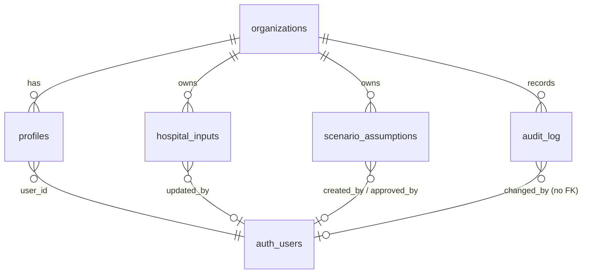

# Database Schema — Phase 1 (Supabase Postgres)

Status: **implemented.** The source of truth is `supabase/migrations/` (`20261008000000_init.sql` for schema, RLS and triggers; `20261008000100_reference_data.sql` for reference data). This document explains the design. It implements the minimum data model from `CLAUDE.md`, with a few additions, each justified below. Behaviour is verified by `supabase/tests/rls.test.ts` through the real Supabase Auth + Data API.

Design rules:

- **Five tables only:** `organizations`, `profiles`, `hospital_inputs`, `scenario_assumptions`, `audit_log`.
- **`NULL` means unknown; `0` means zero.** Never default a hospital value to 0.
- **Calculations are not stored.** They are recomputed from inputs by `src/domain`. The one exception is an approval snapshot, which freezes an approved scenario's figures.
- **Every row carries `organization_id`.** Phase 1 has one organisation (Elite Hospital), but RLS is already org-scoped, so multi-hospital support needs no migration of existing rows.
- **No patient-level data.** No table or column may hold patient-identifiable information.
- **RLS on every table, deny by default.** The audit log is written only by triggers.

## 1. Entity overview

## 2. Enums

| Enum | Values | Notes |
|---|---|---|
| `app_role` | `admin`, `manager`, `viewer`, `referring_physician`, `patient` | The last two are **reserved**. No RLS policy grants them anything. |
| `input_source_type` | `hospital_data`, `verified_public`, `rg_assumption` | Workbook legend: yellow = hospital data, blue = RG assumption. ICU beds = `verified_public`. |
| `savings_level` | `low`, `mid`, `high` | Workbook `Low` / `Mid` / `High` |
| `scenario_status` | `draft`, `approved`, `archived` | Admin-only approval |

## 3. Tables

### `organizations`

| Column | Type | Constraints |
|---|---|---|
| id | uuid | PK, `gen_random_uuid()` |
| name | text | not null |
| created_at | timestamptz | not null, default `now()` |

### `profiles`

One row per platform user, linked to Supabase `auth.users`.

| Column | Type | Constraints |
|---|---|---|
| id | uuid | PK |
| user_id | uuid | not null, unique, FK `auth.users(id)` |
| organization_id | uuid | not null, FK `organizations` |
| full_name | text | not null |
| role | `app_role` | not null, default `viewer` |
| active | boolean | not null, default `true` |
| created_at / updated_at | timestamptz | not null |

Users are **deactivated, never deleted**: `active = false` revokes all access through the RLS helper functions. This keeps audit attribution intact.

### `hospital_inputs`

Key–value store for every hospital input **and** every global Respiratory Gate model assumption. There is one row per `(organization_id, key)`. Keys, labels, units, groups, owners and notes come from the TypeScript input catalog (`src/domain/inputs/catalog.ts`), which is canonical. The seed is generated from it.

| Column | Type | Constraints / meaning |
|---|---|---|
| id | uuid | PK |
| organization_id | uuid | not null, FK |
| key | text | not null; catalog key, e.g. `ventilated_patient_days` |
| category | text | not null; one of `icu_activity`, `unit_costs`, `annual_spend`, `usage`, `equipment`, `billing`, `other_revenue`, `operating_cost`, `model_assumptions` |
| label | text | not null (copied from catalog for audit and report readability) |
| unit | text | not null, e.g. `EGP / yr`, `%`, `patient-days / yr` |
| numeric_value | numeric | **nullable: `NULL` = not yet provided**; ≥ 0; fractions for `%` (≤ 1) |
| text_value | text | nullable qualifier, e.g. the oxygen consumption unit (`m³`) or a source note. Never patient data. |
| data_owner | text | e.g. `Finance`, `Biomedical` |
| note | text | catalog note (workbook column E) |
| source_type | `input_source_type` | not null |
| updated_by | uuid | FK `auth.users`; stamped by trigger |
| updated_at | timestamptz | stamped by trigger |

Unique `(organization_id, key)`.

**Rows seeded per organisation (55):**

- 46 hospital inputs, every yellow cell (`docs/excel-formula-map.md` §3 and §5). All `NULL` except `icu_beds = 50` (`verified_public`, source: Elite Hospital website, 6 Oct 2026).
- 9 `model_assumptions` rows (`rg_assumption`):

  | Key | Default |
  |---|---|
  | `days_per_month` | 30 |
  | `days_per_year` | 365 |
  | `occupancy_scenario_1` … `occupancy_scenario_4` | 0.6, 0.7, 0.8, 0.9 |
  | `price_scenario_1` … `price_scenario_3` | 800, 1,000, 1,200 |

**Addition vs `CLAUDE.md`:** none. The global grids and day counts are stored here as `rg_assumption` rows rather than in a new table. That gives them the same audit trail as hospital inputs.

### `scenario_assumptions`

Named scenario selections plus their savings sensitivities.

| Column | Type | Constraints / meaning |
|---|---|---|
| id | uuid | PK |
| organization_id | uuid | not null, FK |
| scenario_name | text | not null; unique per organisation |
| occupancy_rate | numeric(6,5) | not null, 0 < x ≤ 1 |
| package_price | numeric(12,2) | not null, > 0 (EGP per occupied ICU respiratory patient-day) |
| savings_level | `savings_level` | not null, default `mid` |
| low_savings_pct / mid_savings_pct / high_savings_pct | numeric(6,5) | not null, 0 ≤ x ≤ 1; defaults 0.05 / 0.10 / 0.15 |
| is_default | boolean | not null, default false; **at most one per organisation** (partial unique index). Supplies the default selection and the official sensitivities. |
| status | `scenario_status` | not null, default `draft` |
| approved_by / approved_at | uuid / timestamptz | set by trigger when status becomes `approved` (Admin only) |
| approved_snapshot | jsonb | the inputs, assumptions and `ModelResult` at approval time, so approved figures cannot drift silently |
| created_by / created_at / updated_at | uuid / timestamptz | |

Seeded row: `Workbook default`: 0.8 / 1000 / `mid` / 0.05 / 0.10 / 0.15, `is_default = true`, `status = draft`.

**Additions vs `CLAUDE.md`:** `is_default`, `status`, `approved_by`, `approved_at`, `approved_snapshot`. These implement the "save/approve scenarios" Admin capability without a new table.

### `audit_log`

Append-only change history. It is written **only** by database triggers, so no application code path can skip it.

| Column | Type | Meaning |
|---|---|---|
| id | bigint identity | PK |
| organization_id | uuid | not null |
| entity_type | text | `hospital_input`, `scenario_assumption` or `profile` |
| entity_id | uuid | row id |
| field_name | text | the **input key** for `hospital_input` (`oxygen_spend`; `oxygen_consumption.text` for `text_value`); the column name for the other entities |
| old_value / new_value | text | previous / new value (`NULL` = blank) |
| changed_by | uuid | `auth.uid()` of the person who made the change (`NULL` for system changes). **No foreign key**, so history survives removal of an account |
| actor_name | text | the person's name captured at write time (`System` for migrations or service-role changes) |
| changed_at | timestamptz | default `now()` |
| action | text | `insert`, `update` or `delete` |

`entity_type` also accepts `organization` (organisation renames).

**Additions vs `CLAUDE.md`:** `action` (distinguishes creation and deletion from edits) and `actor_name` (keeps the audit readable after a user account is removed).

## 4. Implementation notes (see the migration for exact SQL)

### Role helpers

Policies call two `SECURITY DEFINER` functions in a **`private` schema**, which the Data API does not expose:

- `private.current_org_id()` returns the caller's organisation (active profiles only).
- `private.has_role(variadic app_role[])` checks the caller's role (active profiles only).

Policies wrap them as `(select private.has_role(...))` so Postgres evaluates them once per statement. Deactivating a profile (`active = false`) therefore removes all access immediately.

### Privileges and policies

| Table | Read | Write |
|---|---|---|
| `organizations` | staff of the organisation | Admin: `name` only |
| `profiles` | own row (any role, so the app can show "no access"); staff see their organisation | Admin: insert; update `full_name`, `role`, `active` |
| `hospital_inputs` | staff | **values only** (`numeric_value`, `text_value` column grants). Admin: any row; Manager: `hospital_data` and `verified_public` rows, never `rg_assumption` |
| `scenario_assumptions` | staff | Manager: insert and edit own drafts (never the default, never approve). Admin: edit, approve, archive, delete non-default |
| `audit_log` | Admin and Manager | nobody — triggers only |

`anon` has no privileges on any table. The reserved `referring_physician` and `patient` roles match no policy except reading their own profile.

`CLAUDE.md` names Admin as the audit-log role. Manager read access is implemented as proposed, so Finance can see who changed the inputs they own; remove `'manager'` from `audit_log_select` if the hospital prefers Admin-only.

### Triggers

| Trigger | Behaviour |
|---|---|
| `hospital_inputs_stamp` (before update) | Sets `updated_by = auth.uid()` and `updated_at` when a value changes |
| `hospital_inputs_audit` (after update) | One audit row per changed value; `field_name` is the input key (`<key>.text` for the text qualifier) |
| `scenario_assumptions_rules` (before insert/update) | New rows are drafts. Approval stamps `approved_by` / `approved_at`. **Changing an approved scenario's numbers returns it to draft** and clears the snapshot. Leaving `approved` clears approval fields |
| `scenario_assumptions_audit` (after insert/update/delete) | Creation, deletion and one row per changed column (jsonb diff) |
| `profiles_keep_one_admin` (before update) | Refuses to demote or deactivate the **last active Admin** |
| `profiles_audit`, `organizations_audit` | Role, access, name changes |

Database constraints also reject negative values and percentages above 100% (`unit = '%'` must be ≤ 1), independent of the app's validation.

### RPC

`public.set_default_scenario(scenario_id)` (security invoker, Admin only) switches the organisation's default scenario in one transaction; a partial unique index guarantees at most one default.

## 5. Reference data

`supabase/migrations/20261008000100_reference_data.sql` is **generated from the TypeScript catalog** (`pnpm db:reference-data`), and `supabase/tests/reference-data.test.ts` fails if they drift. Because it is a migration, `supabase db push` provisions production as well as local databases. It creates:

1. the organisation `Elite Hospital` (fixed id `00000000-0000-4000-8000-000000000001`);
2. 55 `hospital_inputs` rows, every hospital value `NULL` except `icu_beds = 50` (`verified_public`), plus the 9 RG assumption defaults;
3. the `Workbook default` scenario (default, draft).

Re-running it never overwrites values. Once deployed, catalog changes go in a **new** migration.

`supabase/seed.sql` is intentionally empty: users with known passwords are never seeded. The first Admin is created with `pnpm user:create` (temporary password, must be changed at first sign-in) or via the Supabase dashboard; see the README. **No synthetic test values from `tests/fixtures/` are ever seeded.**

## 6. Application access patterns

| Screen | Query |
|---|---|
| All dashboards | `select key, numeric_value, text_value, updated_at, updated_by from hospital_inputs` (≈ 55 rows) + the default scenario |
| Inputs | the same, plus the latest `audit_log` row per key (last changed by / at) |
| Audit | `audit_log` ordered by `changed_at desc`, filter by entity/key/user/date, joined to `profiles.full_name` |
| Scenarios | `scenario_assumptions` for the organisation |

Volumes are tiny (tens of rows plus an append-only log), so there are no performance concerns in Phase 1.

## 7. Future extensions (not built in Phase 1)

| Need | Path |
|---|---|
| Multiple hospitals | Add an org switcher. RLS already scopes by `organization_id`; profiles may later map to several organisations via a join table. |
| Reporting periods (FY2025 vs FY2026 inputs) | Add a `period` column to `hospital_inputs` and widen the unique key to `(organization_id, period, key)`. The audit trail meanwhile serves as history. |
| Physician / patient portals | A **separate schema** (e.g. `clinical`) with its own RLS, encryption and retention, gated by the `CLAUDE.md` PHI checklist. No foreign keys from clinical tables into the financial tables, and no financial-table policies for the reserved roles. |
| Scenario comparison history | `approved_snapshot` already supports it; add a list view. |
