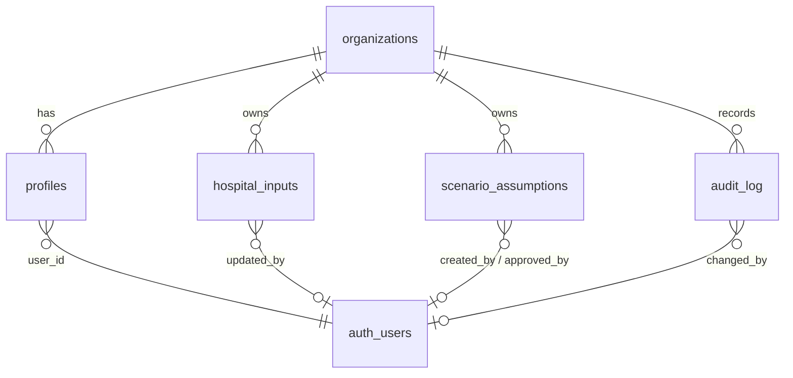

# Database Schema — Phase 1 (Supabase Postgres)

Status: **Step 1 deliverable — design draft.** The SQL below becomes `supabase/migrations/0001_init.sql` in Step 6. It implements the minimum data model from `CLAUDE.md`, with a few additions, each justified below.

Design rules:

- **Five tables only:** `organizations`, `profiles`, `hospital_inputs`, `scenario_assumptions`, `audit_log`.
- **`NULL` means unknown; `0` means zero.** Never default a hospital value to 0.
- **Calculations are not stored.** They are recomputed from inputs by `src/domain`. The one exception is an approval snapshot, which freezes an approved scenario's figures.
- **Every row carries `organization_id`.** Phase 1 has one organisation (Elite Hospital), but RLS is already org-scoped, so multi-hospital support needs no migration of existing rows.
- **No patient-level data.** No table or column may hold patient-identifiable information.
- **RLS on every table, deny by default.** The audit log is written only by triggers.

## 1. Entity overview



## 2. Enums

| Enum | Values | Notes |
|---|---|---|
| `app_role` | `admin`, `manager`, `viewer`, `referring_physician`, `patient` | The last two are **reserved**. No RLS policy grants them anything. |
| `input_source_type` | `hospital_data`, `verified_public`, `rg_assumption` | Workbook legend: yellow = hospital data, blue = RG assumption. ICU beds = `verified_public`. |
| `savings_level` | `low`, `mid`, `high` | Workbook `Low` / `Mid` / `High` |
| `scenario_status` | `draft`, `approved`, `archived` | Admin-only approval |

## 3. Tables

### `organizations`

| Column | Type | Constraints |
|---|---|---|
| id | uuid | PK, `gen_random_uuid()` |
| name | text | not null |
| created_at | timestamptz | not null, default `now()` |

### `profiles`

One row per platform user, linked to Supabase `auth.users`.

| Column | Type | Constraints |
|---|---|---|
| id | uuid | PK |
| user_id | uuid | not null, unique, FK `auth.users(id)` |
| organization_id | uuid | not null, FK `organizations` |
| full_name | text | not null |
| role | `app_role` | not null, default `viewer` |
| active | boolean | not null, default `true` |
| created_at / updated_at | timestamptz | not null |

Users are **deactivated, never deleted**: `active = false` revokes all access through the RLS helper functions. This keeps audit attribution intact.

### `hospital_inputs`

Key–value store for every hospital input **and** every global Respiratory Gate model assumption. There is one row per `(organization_id, key)`. Keys, labels, units, groups, owners and notes come from the TypeScript input catalog (`src/domain/inputs/catalog.ts`), which is canonical. The seed is generated from it.

| Column | Type | Constraints / meaning |
|---|---|---|
| id | uuid | PK |
| organization_id | uuid | not null, FK |
| key | text | not null; catalog key, e.g. `ventilated_patient_days` |
| category | text | not null; one of `icu_activity`, `unit_costs`, `annual_spend`, `usage`, `equipment`, `billing`, `other_revenue`, `operating_cost`, `model_assumptions` |
| label | text | not null (copied from catalog for audit and report readability) |
| unit | text | not null, e.g. `EGP / yr`, `%`, `patient-days / yr` |
| numeric_value | numeric | **nullable: `NULL` = not yet provided**; ≥ 0; fractions for `%` (≤ 1) |
| text_value | text | nullable qualifier, e.g. the oxygen consumption unit (`m³`) or a source note. Never patient data. |
| data_owner | text | e.g. `Finance`, `Biomedical` |
| note | text | catalog note (workbook column E) |
| source_type | `input_source_type` | not null |
| updated_by | uuid | FK `auth.users`; stamped by trigger |
| updated_at | timestamptz | stamped by trigger |

Unique `(organization_id, key)`.

**Rows seeded per organisation (55):**

- 46 hospital inputs, every yellow cell (`docs/excel-formula-map.md` §3 and §5). All `NULL` except `icu_beds = 50` (`verified_public`, source: Elite Hospital website, 6 Oct 2026).
- 9 `model_assumptions` rows (`rg_assumption`):

  | Key | Default |
  |---|---|
  | `days_per_month` | 30 |
  | `days_per_year` | 365 |
  | `occupancy_scenario_1` … `occupancy_scenario_4` | 0.6, 0.7, 0.8, 0.9 |
  | `price_scenario_1` … `price_scenario_3` | 800, 1,000, 1,200 |

**Addition vs `CLAUDE.md`:** none. The global grids and day counts are stored here as `rg_assumption` rows rather than in a new table. That gives them the same audit trail as hospital inputs.

### `scenario_assumptions`

Named scenario selections plus their savings sensitivities.

| Column | Type | Constraints / meaning |
|---|---|---|
| id | uuid | PK |
| organization_id | uuid | not null, FK |
| scenario_name | text | not null; unique per organisation |
| occupancy_rate | numeric(6,5) | not null, 0 < x ≤ 1 |
| package_price | numeric(12,2) | not null, > 0 (EGP per occupied ICU respiratory patient-day) |
| savings_level | `savings_level` | not null, default `mid` |
| low_savings_pct / mid_savings_pct / high_savings_pct | numeric(6,5) | not null, 0 ≤ x ≤ 1; defaults 0.05 / 0.10 / 0.15 |
| is_default | boolean | not null, default false; **at most one per organisation** (partial unique index). Supplies the default selection and the official sensitivities. |
| status | `scenario_status` | not null, default `draft` |
| approved_by / approved_at | uuid / timestamptz | set by trigger when status becomes `approved` (Admin only) |
| approved_snapshot | jsonb | the inputs, assumptions and `ModelResult` at approval time, so approved figures cannot drift silently |
| created_by / created_at / updated_at | uuid / timestamptz | |

Seeded row: `Workbook default`: 0.8 / 1000 / `mid` / 0.05 / 0.10 / 0.15, `is_default = true`, `status = draft`.

**Additions vs `CLAUDE.md`:** `is_default`, `status`, `approved_by`, `approved_at`, `approved_snapshot`. These implement the "save/approve scenarios" Admin capability without a new table.

### `audit_log`

Append-only change history. It is written **only** by database triggers, so no application code path can skip it.

| Column | Type | Meaning |
|---|---|---|
| id | bigint identity | PK |
| organization_id | uuid | not null |
| entity_type | text | `hospital_input`, `scenario_assumption` or `profile` |
| entity_id | uuid | row id |
| field_name | text | the **input key** for `hospital_input` (`oxygen_spend`; `oxygen_consumption.text` for `text_value`); the column name for the other entities |
| old_value / new_value | text | previous / new value (`NULL` = blank) |
| changed_by | uuid | `auth.uid()`, falling back to the row's `updated_by` |
| changed_at | timestamptz | default `now()` |
| action | text | `insert`, `update` or `delete` |

**Addition vs `CLAUDE.md`:** `action`. It distinguishes scenario creation and deletion from edits.

## 4. Draft migration SQL

```sql
-- 0001_init.sql (draft)
create extension if not exists pgcrypto;

create type app_role as enum ('admin','manager','viewer','referring_physician','patient');
create type input_source_type as enum ('hospital_data','verified_public','rg_assumption');
create type savings_level as enum ('low','mid','high');
create type scenario_status as enum ('draft','approved','archived');

create table organizations (
  id uuid primary key default gen_random_uuid(),
  name text not null,
  created_at timestamptz not null default now()
);

create table profiles (
  id uuid primary key default gen_random_uuid(),
  user_id uuid not null unique references auth.users(id),
  organization_id uuid not null references organizations(id),
  full_name text not null,
  role app_role not null default 'viewer',
  active boolean not null default true,
  created_at timestamptz not null default now(),
  updated_at timestamptz not null default now()
);

create table hospital_inputs (
  id uuid primary key default gen_random_uuid(),
  organization_id uuid not null references organizations(id),
  key text not null,
  category text not null check (category in (
    'icu_activity','unit_costs','annual_spend','usage','equipment','billing',
    'other_revenue','operating_cost','model_assumptions')),
  label text not null,
  unit text not null,
  numeric_value numeric check (numeric_value is null or numeric_value >= 0),
  text_value text,
  data_owner text,
  note text,
  source_type input_source_type not null,
  updated_by uuid references auth.users(id),
  updated_at timestamptz not null default now(),
  unique (organization_id, key),
  check (unit <> '%' or numeric_value is null or numeric_value <= 1)
);

create table scenario_assumptions (
  id uuid primary key default gen_random_uuid(),
  organization_id uuid not null references organizations(id),
  scenario_name text not null,
  occupancy_rate numeric(6,5) not null check (occupancy_rate > 0 and occupancy_rate <= 1),
  package_price numeric(12,2) not null check (package_price > 0),
  savings_level savings_level not null default 'mid',
  low_savings_pct  numeric(6,5) not null default 0.05 check (low_savings_pct  between 0 and 1),
  mid_savings_pct  numeric(6,5) not null default 0.10 check (mid_savings_pct  between 0 and 1),
  high_savings_pct numeric(6,5) not null default 0.15 check (high_savings_pct between 0 and 1),
  is_default boolean not null default false,
  status scenario_status not null default 'draft',
  approved_by uuid references auth.users(id),
  approved_at timestamptz,
  approved_snapshot jsonb,
  created_by uuid references auth.users(id) default auth.uid(),
  created_at timestamptz not null default now(),
  updated_at timestamptz not null default now(),
  unique (organization_id, scenario_name)
);
create unique index scenario_assumptions_one_default
  on scenario_assumptions (organization_id) where is_default;

create table audit_log (
  id bigint generated always as identity primary key,
  organization_id uuid not null references organizations(id),
  entity_type text not null check (entity_type in ('hospital_input','scenario_assumption','profile')),
  entity_id uuid not null,
  field_name text not null,
  old_value text,
  new_value text,
  changed_by uuid references auth.users(id),
  changed_at timestamptz not null default now(),
  action text not null default 'update' check (action in ('insert','update','delete'))
);
create index audit_log_org_time on audit_log (organization_id, changed_at desc);
create index audit_log_entity on audit_log (entity_type, entity_id, changed_at desc);
```

### Role helpers (used by every policy)

```sql
create function app_current_org() returns uuid
language sql stable security definer set search_path = public as $$
  select organization_id from profiles where user_id = auth.uid() and active
$$;

create function app_has_role(variadic roles app_role[]) returns boolean
language sql stable security definer set search_path = public as $$
  select exists (
    select 1 from profiles
    where user_id = auth.uid() and active and role = any(roles)
  )
$$;
```

(`current_role` is a reserved SQL keyword, hence the `app_` prefix.)

### Row-level security

```sql
alter table organizations        enable row level security;
alter table profiles             enable row level security;
alter table hospital_inputs      enable row level security;
alter table scenario_assumptions enable row level security;
alter table audit_log            enable row level security;

-- Staff = admin, manager, viewer. Reserved roles match no policy.
create policy org_read on organizations for select
  using (id = app_current_org() and app_has_role('admin','manager','viewer'));
create policy org_admin_update on organizations for update
  using (id = app_current_org() and app_has_role('admin'));

create policy profiles_read on profiles for select
  using (organization_id = app_current_org() and app_has_role('admin','manager','viewer'));
create policy profiles_admin_update on profiles for update
  using (organization_id = app_current_org() and app_has_role('admin'))
  with check (organization_id = app_current_org());
-- Inserts: server-side invite action only (service role), never from the browser.

create policy inputs_read on hospital_inputs for select
  using (organization_id = app_current_org() and app_has_role('admin','manager','viewer'));
create policy inputs_update on hospital_inputs for update
  using (organization_id = app_current_org() and (
         app_has_role('admin')
      or (app_has_role('manager') and source_type in ('hospital_data','verified_public'))))
  with check (organization_id = app_current_org());
-- Only values are editable from the app; keys/metadata change through migrations/seed.
revoke update on hospital_inputs from authenticated;
grant  update (numeric_value, text_value) on hospital_inputs to authenticated;

create policy scenarios_read on scenario_assumptions for select
  using (organization_id = app_current_org() and app_has_role('admin','manager','viewer'));
create policy scenarios_insert on scenario_assumptions for insert
  with check (organization_id = app_current_org() and app_has_role('admin','manager')
              and status = 'draft' and not is_default);
create policy scenarios_update on scenario_assumptions for update
  using (organization_id = app_current_org() and (
         app_has_role('admin')
      or (app_has_role('manager') and status = 'draft' and not is_default)))
  with check (organization_id = app_current_org() and (
         app_has_role('admin')
      or (status = 'draft' and not is_default)));
create policy scenarios_admin_delete on scenario_assumptions for delete
  using (organization_id = app_current_org() and app_has_role('admin'));

create policy audit_read on audit_log for select
  using (organization_id = app_current_org() and app_has_role('admin','manager'));
revoke insert, update, delete on audit_log from authenticated, anon;
```

`CLAUDE.md` names Admin as the audit-log role. Manager read access (`audit_read`) is a proposed extension so Finance can see who changed the inputs they own; confirm it before Step 6.

### Triggers

```sql
-- Stamp who/when on every input change.
create function stamp_hospital_input() returns trigger
language plpgsql as $$
begin
  new.updated_by := coalesce(auth.uid(), new.updated_by);
  new.updated_at := now();
  return new;
end $$;
create trigger hospital_inputs_stamp before update on hospital_inputs
  for each row execute function stamp_hospital_input();

-- Audit input value changes, field_name = input key.
create function audit_hospital_input() returns trigger
language plpgsql security definer set search_path = public as $$
begin
  if new.numeric_value is distinct from old.numeric_value then
    insert into audit_log (organization_id, entity_type, entity_id, field_name,
                           old_value, new_value, changed_by, action)
    values (new.organization_id, 'hospital_input', new.id, new.key,
            old.numeric_value::text, new.numeric_value::text, new.updated_by, 'update');
  end if;
  if new.text_value is distinct from old.text_value then
    insert into audit_log (organization_id, entity_type, entity_id, field_name,
                           old_value, new_value, changed_by, action)
    values (new.organization_id, 'hospital_input', new.id, new.key || '.text',
            old.text_value, new.text_value, new.updated_by, 'update');
  end if;
  return new;
end $$;
create trigger hospital_inputs_audit after update on hospital_inputs
  for each row execute function audit_hospital_input();
```

- **`scenario_assumptions`**:
  - A `BEFORE UPDATE` trigger sets `updated_at`. When `status` changes to `approved`, it requires `app_has_role('admin')` and sets `approved_by = auth.uid()` and `approved_at = now()`.
  - An `AFTER INSERT/UPDATE/DELETE` trigger writes one `audit_log` row per changed column, using a generic `jsonb` diff of `to_jsonb(old)` against `to_jsonb(new)`. It excludes `updated_at` and `approved_snapshot`; the snapshot is recorded as `approved_snapshot` changed, without the payload.
- **`profiles`**: an `AFTER UPDATE` trigger audits changes to `role`, `active` and `full_name`.

## 5. Seed data

`supabase/seed.sql` is **generated from the TypeScript catalog** (`pnpm db:seed`), so labels, units and keys cannot drift from the engine. A test compares the generated SQL with the catalog. The seed contains:

1. the organisation `Elite Hospital`;
2. 55 `hospital_inputs` rows, every hospital value `NULL` except `icu_beds = 50` (`verified_public`), and the 9 RG assumption defaults;
3. the `Workbook default` scenario.

There are no users in the seed. The first admin is created with the Supabase CLI or dashboard plus a one-off SQL insert into `profiles`; the README will document this in Step 6. **No synthetic test values from `tests/fixtures/` are ever seeded.**

## 6. Application access patterns

| Screen | Query |
|---|---|
| All dashboards | `select key, numeric_value, text_value, updated_at, updated_by from hospital_inputs` (≈ 55 rows) + the default scenario |
| Inputs | the same, plus the latest `audit_log` row per key (last changed by / at) |
| Audit | `audit_log` ordered by `changed_at desc`, filter by entity/key/user/date, joined to `profiles.full_name` |
| Scenarios | `scenario_assumptions` for the organisation |

Volumes are tiny (tens of rows plus an append-only log), so there are no performance concerns in Phase 1.

## 7. Future extensions (not built in Phase 1)

| Need | Path |
|---|---|
| Multiple hospitals | Add an org switcher. RLS already scopes by `organization_id`; profiles may later map to several organisations via a join table. |
| Reporting periods (FY2025 vs FY2026 inputs) | Add a `period` column to `hospital_inputs` and widen the unique key to `(organization_id, period, key)`. The audit trail meanwhile serves as history. |
| Physician / patient portals | A **separate schema** (e.g. `clinical`) with its own RLS, encryption and retention, gated by the `CLAUDE.md` PHI checklist. No foreign keys from clinical tables into the financial tables, and no financial-table policies for the reserved roles. |
| Scenario comparison history | `approved_snapshot` already supports it; add a list view. |
