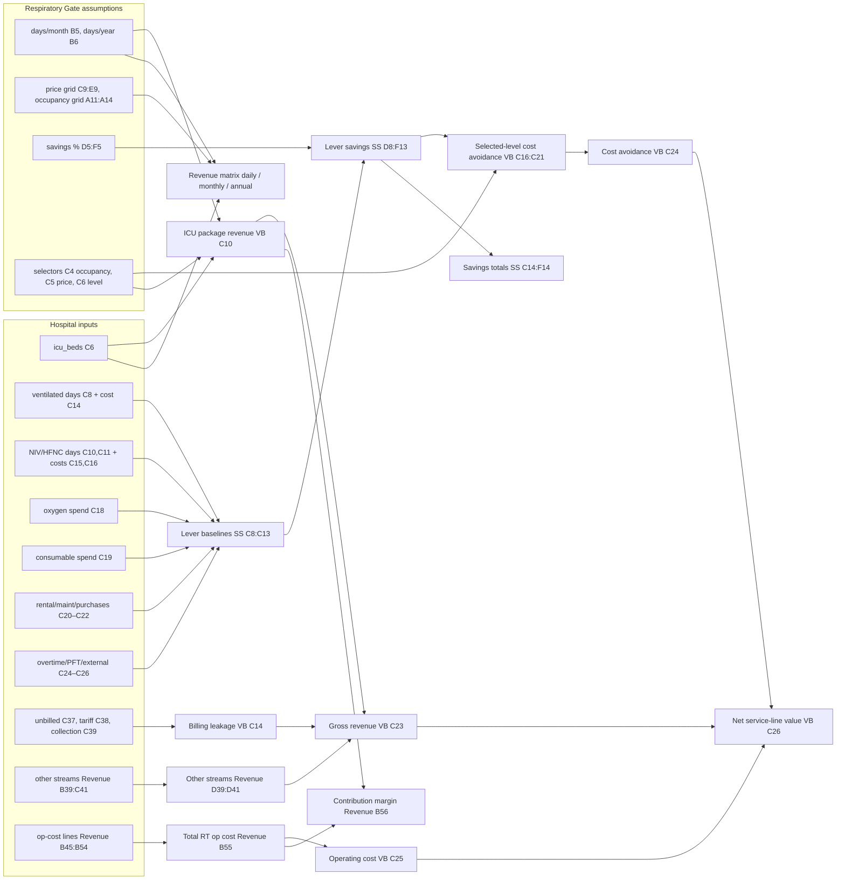

# Excel Formula Map — `Elite_RT_Value_Calculator.xlsx`

Status: **Step 1 deliverable** (repository understanding). This document is the contract between the reference workbook and the TypeScript calculation engine. Every formula cell is listed with its meaning, its planned domain function, and its edge-case behaviour.

- Source: `data/Elite_RT_Value_Calculator.xlsx` (SHA-256 recorded in `tests/fixtures/workbook-parity.json`)
- Sheets: `Read Me`, `Inputs`, `Savings Scenarios`, `Revenue`, `Value Bridge`
- 132 formula cells, 0 named ranges, 0 macros, 0 hidden sheets, 0 sheet protection, 0 external links
- Data validation: only `Value Bridge!C4:C6` (scenario dropdowns)
- Cached values: present (workbook was recalculated after generation); as delivered, the only computed money value is ICU package gross potential = **EGP 14,600,000**

## How this was verified

1. Every cell was dumped with formula, cached value, fill, font colour and number format (openpyxl).
2. `scripts/workbook/generate_parity_fixtures.py` fills 10 scenarios into copies of the workbook, recalculates them in LibreOffice 24.2 headless, and stores every formula cell's result in `tests/fixtures/workbook-parity.json`.
3. An independent re-implementation of the formulas below was checked against those fixtures: **1,320 of 1,320 formula results matched** (relative tolerance 1e-9).

The TypeScript tests (Step 3) replay the same fixtures. LibreOffice and Excel agree on every function used here (`IF`, `OR`, `AND`, `N`, `COUNT`, `SUM`, `SUMIF`, `INDEX`, `MATCH`, `ISNUMBER`). A spot check of one populated scenario in desktop Excel by Elite Finance is still recommended before go-live.

---

## 1. Cell classification

The workbook's own legend (`Read Me!A7:B10`) maps directly onto the four classes required by `CLAUDE.md`:

| Class | Code | Workbook signal | Web-app home |
|---|---|---|---|
| Hospital input | **HI** | Yellow fill (`#FFFF00`) | `hospital_inputs` (source `hospital_data`), Inputs screen |
| Respiratory Gate assumption | **RGA** | Blue bold text (`#0000FF`) | `hospital_inputs` (source `rg_assumption`) or `scenario_assumptions`, editable by Admin |
| Derived calculation | **DC** | Black text = formula, green text = cross-sheet link | `src/domain/calculations/*` — never stored |
| Display-only text | **TXT** | Labels, notes, headers | Input catalog metadata and UI copy |

Exception: `Inputs!C6` (ICU beds = 50) is styled as a blue assumption but its owner column says **Verified** and `Read Me!B16` cites the Elite Hospital website. It is classified **HI** with source type `verified_public` (a hospital fact from a public source, replaceable by Elite's own figure).

Two TXT ranges are **functional**: lookups and conditional sums match against them, so they become typed enums rather than free text.

- `Savings Scenarios!D4:F4` = `Low` / `Mid` / `High`. `MATCH` uses these to resolve the savings selector, so they become the `SavingsLevel` enum.
- `Value Bridge!B10:B21` = `Revenue` / `Cost` / `Cost avoidance`. `SUMIF` uses these for the totals, so they become the `BridgeStepType` enum.

---

## 2. Sheet `Read Me` — all TXT

| Cells | Content | Web-app use |
|---|---|---|
| A1:A2 | Title, "Discussion draft, October 2026" | Report footer provenance |
| A4:B6 | Purpose, status, how to use | Onboarding / empty-state copy |
| A7:B10 | Colour legend | Source-type badges (hospital data / RG assumption / calculated) |
| A11:B15 | **Rules 1–5** (financial guardrails) | Pinned guardrail copy on Revenue, Savings, Value Bridge and the executive report |
| A16:B16 | Source of ICU beds = 50 | Provenance note on `icu_beds` |

Rules 1–5 verbatim (to be reproduced in `src/domain/copy/guardrails.ts`):

1. Gross revenue is not profit. Contribution margin requires Elite cost data.
2. Package price (EGP 800–1,200 per occupied ICU respiratory patient-day) is a commercial assumption, subject to Elite Finance, payer and contract validation; not an established Egyptian reimbursement rate.
3. Savings percentages (5% / 10% / 15%) are sensitivities applied to Elite's baseline, not forecasts or claims.
4. Ventilator, NIV/HFNC and consumable levers can overlap (circuits, filters, interfaces). Finance should de-duplicate before quoting a total.
5. Recovered billing (unbilled eligible activity × tariff × collection rate) is counted as revenue on the Value Bridge, not as a saving.

---

## 3. Sheet `Inputs` — hospital inputs

TXT: `A1:A2` (title, instruction), `A4:E4` (header), section headers `A5, A13, A17, A27, A35`, and per-row `A` label / `B` unit / `D` data owner / `E` note. The per-row text becomes **input catalog metadata** (`src/domain/inputs/catalog.ts`), not data.

All values are annual unless stated. Percentages are stored as fractions (0.8 = 80%), exactly as in the workbook; the UI accepts and shows percent.

**Web group** follows `CLAUDE.md` (ICU Activity, Unit Costs, Annual Spend, Usage, Equipment, Billing). The workbook has no "Equipment" section, so inventory and utilisation (rows 33–34) move from USAGE into **Equipment**. Equipment *spend* (rows 20–22) stays in **Annual Spend** because the savings lever treats it as spend.

**Used by** = which calculation reads the cell. *Informational* cells are collected and counted for data completeness, but no formula references them.

| Cell | Key | Label | Unit | Owner | Web group | Class | Used by | Validation |
|---|---|---|---|---|---|---|---|---|
| C6 | `icu_beds` | ICU beds | beds | Verified (public) | ICU Activity | HI | Revenue grid, ICU package revenue | integer ≥ 1 |
| C7 | `icu_occupancy_rate_actual` | ICU occupancy rate | % | ICU / Admissions | ICU Activity | HI | *Informational* (see F2) | 0–100% |
| C8 | `ventilated_patient_days` | Ventilated patient-days | patient-days / yr | ICU | ICU Activity | HI | Ventilator lever | integer ≥ 0; warn if > beds × days/yr |
| C9 | `avg_ventilator_days_per_patient` | Average ventilator days per patient | days | ICU | ICU Activity | HI | *Informational* | ≥ 0, 1 dp |
| C10 | `niv_patient_days` | NIV patient-days | patient-days / yr | ICU | ICU Activity | HI | NIV/HFNC lever | integer ≥ 0 |
| C11 | `hfnc_patient_days` | HFNC patient-days | patient-days / yr | ICU | ICU Activity | HI | NIV/HFNC lever | integer ≥ 0 |
| C12 | `oxygen_consumption` | Oxygen consumption | m³ or units / yr | Supply chain | ICU Activity | HI | *Informational* | ≥ 0; unit required in text value |
| C14 | `cost_per_ventilator_day` | Cost per ventilator-day | EGP | Finance | Unit Costs | HI | Ventilator lever | EGP ≥ 0 |
| C15 | `cost_per_niv_day` | Cost per NIV day | EGP | Finance | Unit Costs | HI | NIV/HFNC lever | EGP ≥ 0 |
| C16 | `cost_per_hfnc_day` | Cost per HFNC day | EGP | Finance | Unit Costs | HI | NIV/HFNC lever | EGP ≥ 0 |
| C18 | `oxygen_spend` | Oxygen spend | EGP / yr | Finance | Annual Spend | HI | Oxygen lever | EGP ≥ 0 |
| C19 | `respiratory_consumable_spend` | Respiratory consumable expenditure | EGP / yr | Finance | Annual Spend | HI | Consumable lever | EGP ≥ 0 |
| C20 | `equipment_rental_spend` | Respiratory equipment rental | EGP / yr | Biomedical | Annual Spend | HI | Equipment lever | EGP ≥ 0 |
| C21 | `equipment_maintenance_spend` | Respiratory equipment maintenance | EGP / yr | Biomedical | Annual Spend | HI | Equipment lever | EGP ≥ 0 |
| C22 | `planned_equipment_purchases` | Planned respiratory equipment purchases | EGP / yr | Biomedical | Annual Spend | HI | Equipment lever | EGP ≥ 0 |
| C23 | `respiratory_staffing_spend` | Current respiratory staffing expenditure | EGP / yr | HR / Finance | Annual Spend | HI | *Informational* (see F7) | EGP ≥ 0 |
| C24 | `respiratory_overtime_spend` | Overtime expenditure (respiratory-related) | EGP / yr | HR / Finance | Annual Spend | HI | Staffing lever | EGP ≥ 0 |
| C25 | `pft_outsourcing_spend` | PFT outsourcing | EGP / yr | Finance | Annual Spend | HI | Staffing lever | EGP ≥ 0 |
| C26 | `external_respiratory_services_spend` | External respiratory service expenditure | EGP / yr | Finance | Annual Spend | HI | Staffing lever | EGP ≥ 0 |
| C28 | `ventilator_circuits_used` | Ventilator circuit usage | units / yr | Supply chain | Usage | HI | *Informational* | integer ≥ 0 |
| C29 | `filters_used` | Filter usage | units / yr | Supply chain | Usage | HI | *Informational* | integer ≥ 0 |
| C30 | `closed_suction_used` | Closed suction usage | units / yr | Supply chain | Usage | HI | *Informational* | integer ≥ 0 |
| C31 | `hfnc_circuits_used` | HFNC circuit usage | units / yr | Supply chain | Usage | HI | *Informational* | integer ≥ 0 |
| C32 | `niv_interfaces_used` | NIV interface usage | units / yr | Supply chain | Usage | HI | *Informational* | integer ≥ 0 |
| C33 | `respiratory_equipment_inventory` | Respiratory equipment inventory | devices | Biomedical | Equipment | HI | *Informational* | integer ≥ 0 |
| C34 | `respiratory_equipment_utilization_rate` | Respiratory equipment utilization rate | % | Biomedical | Equipment | HI | *Informational* | 0–100% |
| C36 | `billable_respiratory_activities` | Current billable respiratory activities | activities / yr | Finance / Billing | Billing | HI | *Informational* | integer ≥ 0 |
| C37 | `unbilled_eligible_respiratory_activities` | Unbilled eligible respiratory activities | activities / yr | Finance / Billing | Billing | HI | Billing leakage | integer ≥ 0 |
| C38 | `avg_tariff_per_respiratory_activity` | Average tariff per respiratory activity | EGP | Finance / Billing | Billing | HI | Billing leakage | EGP ≥ 0 |
| C39 | `collection_rate` | Actual collection rate | % | Finance | Billing | HI | Billing leakage | 0–100% |

Notes (column E) are carried verbatim into the catalog.

---

## 4. Sheet `Savings Scenarios` — cost avoidance

TXT: `A1:A2`, `A4`, `A5`, `D4:F4` (functional — `SavingsLevel`), `A7:F7`, lever names `A8:A13`, baseline descriptions `B8:B13` (become each lever's "calculation basis" text), `A14:B14`, `A16`.

### Assumptions (RGA)

| Cell | Key | Default | Meaning |
|---|---|---|---|
| D5 | `savings_pct_low` | 0.05 | Low sensitivity applied to every lever |
| E5 | `savings_pct_mid` | 0.10 | Mid sensitivity |
| F5 | `savings_pct_high` | 0.15 | High sensitivity |

### Lever baselines (DC, column C)

Workbook convention: a baseline formula returns `""` when it cannot be computed.

| Row | Lever (`SavingsLeverId`) | Workbook formula | Plain meaning | Quantified when | Partial behaviour |
|---|---|---|---|---|---|
| 8 | `ventilator_resources` | `IF(OR(C8="",C14=""),"",C8*C14)` | ventilated days × cost per ventilator-day | both present | — |
| 9 | `niv_hfnc_utilization` | `IF(AND(OR(C10="",C15=""),OR(C11="",C16="")),"",N(C10)*N(C15)+N(C11)*N(C16))` | NIV days × NIV cost + HFNC days × HFNC cost | at least one pair complete | a blank cell in the other pair counts as 0 |
| 10 | `oxygen_stewardship` | `IF(C18="","",C18)` | oxygen spend | present | — |
| 11 | `consumable_standardization` | `IF(C19="","",C19)` | consumable spend | present | — |
| 12 | `equipment_utilization` | `IF(COUNT(C20,C21,C22)=0,"",SUM(C20,C21,C22))` | rental + maintenance + planned purchases | ≥ 1 of 3 present | blank components excluded |
| 13 | `staffing_outsourcing` | `IF(COUNT(C24,C25,C26)=0,"",SUM(C24,C25,C26))` | overtime + PFT outsourcing + external services | ≥ 1 of 3 present | blank components excluded |

(All `C…` references above are `Inputs!$C$…`.)

### Lever savings (DC, D8:F13)

`D{r} = IF(C{r}="","Baseline required",C{r}*D$5)` and likewise for E (Mid) and F (High).

Domain: `leverSaving(baseline, pct)` → `missing("Baseline required")` when the baseline is missing, otherwise `baseline × pct`.

### Totals (DC, row 14)

`C14 = IF(COUNT(C8:C13)=0,"Baseline required",SUM(C8:C13))`, and likewise for D14, E14 and F14.

This sums only the levers that have a number. Levers still waiting for a baseline are excluded, as the `A16` note says. **The overlap between levers (Rule 4) is not de-duplicated anywhere in the workbook.**

---

## 5. Sheet `Revenue`

TXT: `A1:A2`, `A4:A6`, `C5:C6` (assumption notes), `A8`, `B9`, `A10`, section headers `A16, A23, A30, A37, A43`, table headers rows 17/24/31/38, stream names `A39:A41`, formula notes `E39:E41`, cost-line labels `A44:A56`.

### Assumptions (RGA)

| Cell | Key | Default | Meaning |
|---|---|---|---|
| B5 | `days_per_month` | 30 | Month length for the monthly view |
| B6 | `days_per_year` | 365 | Year length for annual figures and the Value Bridge |
| C9, D9, E9 | `price_scenario_1..3` | 800, 1,000, 1,200 | Package price grid (EGP per occupied ICU respiratory patient-day) |
| A11:A14 | `occupancy_scenario_1..4` | 0.6, 0.7, 0.8, 0.9 | Occupancy grid |

### Derived (DC)

| Cells | Formula pattern | Domain |
|---|---|---|
| B4 | `=Inputs!$C$6` | `icu_beds` (link) |
| C17:E17, C24:E24, C31:E31 | `=C$9` … | price-grid header echo (display) |
| A18:A21, A25:A28, A32:A35 | `=$A$11` … | occupancy-grid echo (display) |
| B18:B21, B25:B28, B32:B35 | `=$B$4*A{r}` | `occupiedBeds = beds × occupancy` (**not rounded**: 45 × 0.55 = 24.75) |
| C18:E21 | `=$B{r}*C$9` | daily gross = occupied beds × price |
| C25:E28 | `=$B{r}*C$9*$B$5` | monthly gross = occupied beds × price × days/month |
| C32:E35 | `=$B{r}*C$9*$B$6` | annual gross = occupied beds × price × days/year |
| D39:D41 | `=IF(OR(B{r}="",C{r}=""),"Scenario pending",B{r}*C{r})` | other stream gross = volume × price |
| B44 | `='Value Bridge'!C10` | ICU package gross for the *selected* scenario |
| B55 | `=IF(COUNT(B45:B54)=0,"Elite data required",SUM(B45:B54))` | total RT operating cost |
| B56 | `=IF(ISNUMBER(B55),B44-B55,"Elite data required")` | contribution margin = ICU package gross − RT operating cost |

Row 20 / 27 / 34 (80% occupancy) is highlighted in the workbook as the reference case; `D34` = **EGP 14,600,000**.

### Other revenue streams (HI — yellow)

| Cells | Keys | Formula note |
|---|---|---|
| B39, C39 | `pft_annual_tests`, `pft_price_per_test` | Tests a year × Elite PFT tariff |
| B40, C40 | `education_annual_participants`, `education_fee_per_participant` | Participants × course fee |
| B41, C41 | `future_programs_annual_enrolled`, `future_programs_fee` | Enrolled patients × program fee |

Web group: **Other Revenue Streams** (added beyond the six `CLAUDE.md` groups because the Value Bridge needs it). "Enrolled patients" here is an aggregate count, not patient-level data.

### RT operating cost lines (HI — yellow)

| Cell | Key | Label |
|---|---|---|
| B45 | `opcost_rt_salaries` | RT salaries |
| B46 | `opcost_supervisor_salaries` | Supervisor / lead salaries |
| B47 | `opcost_clinical_education` | Clinical education |
| B48 | `opcost_consumables_incremental` | Consumables (incremental) |
| B49 | `opcost_equipment_depreciation` | Equipment depreciation |
| B50 | `opcost_maintenance` | Maintenance |
| B51 | `opcost_documentation_technology` | Documentation / technology |
| B52 | `opcost_training` | Training |
| B53 | `opcost_admin_overhead` | Admin / management overhead |
| B54 | `opcost_supply_chain_logistics` | Supply chain / logistics |

Web group: **RT Operating Cost**. All EGP / yr, ≥ 0.

---

## 6. Sheet `Value Bridge`

TXT: `A1:A2`, `A4:A6` labels, `D4` note, `A8:D8` header, step names `A10:A21`, step types `B10:B21` (functional — `BridgeStepType`), total labels `A23:A26`, `D26` caveat, `A28` check note.

### Scenario selectors (RGA, data-validated)

| Cell | Key | Default | Dropdown list (hard-coded) |
|---|---|---|---|
| C4 | `selected_occupancy` | 0.8 | `0.6,0.7,0.8,0.9` |
| C5 | `selected_package_price` | 1000 | `800,1000,1200` |
| C6 | `selected_savings_level` | Mid | `Low,Mid,High` |

### Bridge steps (DC)

| Row | Step | Type | Formula | Missing → |
|---|---|---|---|---|
| 10 | ICU package revenue (gross) | Revenue | `=Revenue!$B$4*$C$4*$C$5*Revenue!$B$6` | never (blank beds → 0, see F3) |
| 11 | PFT revenue | Revenue | `=Revenue!D39` | `Scenario pending` |
| 12 | Education revenue | Revenue | `=Revenue!D40` | `Scenario pending` |
| 13 | Future clinical programs | Revenue | `=Revenue!D41` | `Scenario pending` |
| 14 | Billing leakage recovery | Revenue | `=IF(OR(C37="",C38="",C39=""),"Baseline required",C37*C38*C39)` (Inputs) | `Baseline required` |
| 15 | RT service operating cost | Cost | `=IF(ISNUMBER(Revenue!$B$55),-Revenue!$B$55,"Elite data required")` | `Elite data required` |
| 16–21 | Six savings levers | Cost avoidance | `=INDEX('Savings Scenarios'!$D$r:$F$r,MATCH($C$6,'Savings Scenarios'!$D$4:$F$4,0))` | `Baseline required` |

`D10:D21`: `=IF(ISNUMBER(C{r}),"Calculated","Not yet quantified — excluded")`.

The ICU package step does not look up the revenue grid. It multiplies the selector values directly, so off-grid selector values still calculate.

### Totals (DC)

| Cell | Formula | Domain |
|---|---|---|
| C23 | `=SUMIF(B10:B21,"Revenue",C10:C21)` | gross revenue = sum of quantified revenue steps |
| C24 | `=SUMIF(B10:B21,"Cost avoidance",C10:C21)` | cost avoidance = sum of quantified levers for the selected level |
| C25 | `=SUMIF(B10:B21,"Cost",C10:C21)` | operating cost (negative number; 0 when missing) |
| C26 | `=IF(COUNT(C15)=0,"To be quantified",SUM(C23:C25))` | **net respiratory service-line value**, shown only when operating cost is numeric |

Sign convention: the workbook stores operating cost as a negative number and sums all three rows. The domain layer keeps cost positive and computes `gross revenue + cost avoidance − operating cost`. The two are arithmetically identical.

---

## 7. Dependency graph



---

## 8. Domain mapping (planned `src/domain/calculations/`)

Each output is a `Quantity`, never a bare number. The three variants are listed below (invalid values are rejected at input time, so the engine never sees them); full design in `docs/mvp-architecture.md` §5.

- `calculated` — a value and its basis.
- `partial` — a value whose workbook formula silently excluded blank components; it lists the missing inputs.
- `missing` — no value; carries the workbook label and the required inputs.

| Workbook output | Module / function | Missing label (verbatim) |
|---|---|---|
| Revenue B18:E35 | `revenue.occupancyPriceMatrix(beds, occupancies, prices, days)` → daily / monthly / annual | `Data required` (beds missing — deviation D1) |
| VB C10 / Revenue B44 | `revenue.icuPackageAnnualGross(beds, occupancy, price, daysPerYear)` | `Data required` (deviation D1) |
| Revenue D39:D41, VB C11:C13 | `revenue.otherStreamGross(volume, price)` | `Scenario pending` |
| VB C14 | `revenue.billingLeakageRecovery(unbilled, tariff, collectionRate)` | `Baseline required` |
| SS C8:C13 | `savings.leverBaseline(leverId, inputs)` | (`""` → missing) |
| SS D8:F13 | `savings.leverSaving(baseline, pct)` | `Baseline required` |
| SS C14:F14 | `savings.totals(levers)` | `Baseline required` |
| VB C16:C21 | `savings.selectedLevelSavings(levers, level)` | `Baseline required` |
| Revenue B55 | `operatingCost.total(lines)` | `Data required` (workbook: `Elite data required`) |
| Revenue B56 | `operatingCost.contributionMargin(icuGross, total)` | `Data required` |
| VB C23:C25 | `valueBridge.build(...)` totals | (always numeric; excluded steps listed) |
| VB C26 | `valueBridge.netServiceLineValue(...)` | `To be quantified` |
| VB D10:D21 | `valueBridge.stepStatus(q)` | `Calculated` / `Not yet quantified — excluded` |

The workbook says "Elite" in its labels; the platform says "hospital" or "Data required". The organisation name comes from the `organizations` table.

---

## 9. Findings, discrepancies and how the platform treats them

**Parity principle:** whenever the workbook produces a number, the engine produces the same number. Improvements show up only as status flags and warnings, never as different arithmetic. The single exception is D1.

| # | Finding | Evidence (fixture) | Platform treatment |
|---|---|---|---|
| F1 | **Partial components are summed silently.** Equipment (C20–C22), staffing & outsourcing (C24–C26) and the NIV/HFNC pair rule produce a number when only some components are entered. | `partial-components`, `niv-incomplete-hfnc-complete` | Same number; status `partial`, listing the missing inputs ("Partial — maintenance and planned purchases not entered"). A blank means unknown; enter **0** to declare "none". |
| F2 | **ICU occupancy actual (`Inputs!C7`) is not used by any formula.** The bridge uses the selector `VB!C4`; note `D4` says actual occupancy "can replace this once known". | all | Selector offers the grid values plus "Hospital actual (x%)" once C7 is entered. The default stays at the workbook's 80%. |
| F3 / D1 | **Blank ICU beds is treated as 0**, and VB C10 reports a "Calculated" EGP 0. | `icu-beds-blank` | **Deliberate deviation D1:** `missing("Data required")`. Showing a calculated zero would break the "no fake zeros" rule. A test documents both the workbook value and the deviation. |
| F4 | **Operating cost total accepts any subset of the 10 lines**, so the net service-line value and contribution margin appear once a single line is entered (fixture: 1 of 10 lines → net EGP 10,142,000). | `partial-components` | Same number, status `partial` with the badge "Provisional — operating cost incomplete (1 of 10 lines)". The report never presents a partial net value as profit. Finance enters 0 for lines that do not apply. |
| F5 | **Monthly × 12 ≠ annual.** Monthly uses 30 days and annual uses 365, so 12 months = 360 days (EGP 14.4M vs 14.6M at 80% / EGP 1,000). | `full-*` | Preserved. The Revenue screen's monthly view carries the note "30-day month assumption; annual uses 365 days". |
| F6 | **Selector dropdowns are hard-coded** and not linked to the editable grids. Editing `Revenue!A11` leaves the dropdown at 0.6, and VB C10 computes off-grid values anyway. | `edited-assumptions` (75% / EGP 1,100 accepted) | Selector options derive from the grids (single source of truth). Off-grid values are allowed only via "custom", clearly labelled. |
| F7 | **Unused hospital inputs:** C7, C9, C12, C23, C28–C34 and C36 (12 cells) feed no formula. Staffing *expenditure* (C23) is outside the staffing lever, which applies only to overtime, PFT outsourcing and external services. | — | Collected and counted in "all requested data" completeness, labelled *Informational — not used in calculations*. The engine does not invent uses for them. |
| F8 | **Overlapping levers are summed** in SS C14:F14 and VB C24 (Rule 4). | — | Same totals, always shown with an overlap warning. The executive report shows the levers individually first and the total as "Undeduplicated sum". |
| F9 | **No input validation.** Text in a numeric cell gives `#VALUE!` cascading to the net value; entering `80` instead of `0.8` inflates revenue 100×; negatives are accepted. | — | Strict typed validation: numbers only, ≥ 0, percentages entered as % and stored as fractions, integer checks where relevant, plausibility warnings (e.g. ventilated days > beds × 365). |
| F10 | **No rounding anywhere.** Occupied beds can be fractional (24.75); number formats only round the display. | `edited-assumptions` | Full precision through the engine; round only when formatting. Parity tolerance is relative 1e-9. |
| F11 | **Status vocabulary varies by sheet:** `Baseline required`, `Scenario pending`, `Elite data required`, `To be quantified`, `Not yet quantified — excluded`, `Calculated`. | all | Kept as a typed label set in `src/domain/copy/statusLabels.ts`; "Elite data required" becomes "Data required". |
| F12 | **Contribution margin (Revenue B56) ≠ net service-line value (VB C26).** The margin covers the ICU package only; net value includes other streams, billing leakage and cost avoidance. | `full-mid-80-1000`: margin 4.70M, net 12.45M | Both shown, each with its own definition. Never conflated. |
| F13 | **Equipment lever includes planned purchases (capital)**, so a % of a capex budget is mixed into annual cost avoidance. | — | Preserved for parity; basis text says "includes planned capital purchases". Raised as an open question for Finance (Q3). |
| F14 | **ICU package revenue assumes every occupied ICU bed-day is a package patient-day** (100% uptake). | — | Preserved; stated in the calculation basis. Open question Q1. |
| F15 | **PFT appears twice:** outsourcing spend sits in the staffing lever and in-house PFT revenue is a revenue stream. Both can be legitimate, but they may describe the same activity. | — | Overlap note on both items. Open question Q4. |
| F16 | Explicit zeros are honoured: `0` produces calculated zeros, distinct from blanks. | `zero-vs-blank` | Same. Inputs store `NULL` for unknown and `0` for zero; the UI never shows "0" for unknown. |

### Open questions for Elite Finance / Respiratory Gate

- **Q1.** Should ICU package revenue apply a package-eligibility or uptake percentage, rather than assume 100% of occupied ICU days?
- **Q2.** How should overlapping levers be de-duplicated (Rule 4)? Options are a Finance-specified overlap adjustment, or quoting levers individually only.
- **Q3.** Should planned capital purchases stay inside the annual equipment-utilisation saving, or be reported as one-off capex avoidance?
- **Q4.** Do PFT outsourcing savings and in-house PFT revenue describe the same tests, so one should be netted against the other?
- **Q5.** Should actual occupancy (C7), once entered, become the default selector value?
- **Q6.** Should staffing expenditure (C23) ever be in scope for the staffing lever? The workbook deliberately leaves it out.

Until these are answered, the platform preserves workbook behaviour.

---

## 10. Data completeness definition

| Measure | Cells | Count | As delivered |
|---|---|---|---|
| **Model inputs** (feed at least one calculation) | Inputs C6, C8, C10, C11, C14–C16, C18–C22, C24–C26, C37–C39; Revenue B39:C41, B45:B54 | 34 | 1 / 34 (ICU beds) |
| **All requested data** (every yellow cell plus ICU beds) | model inputs + C7, C9, C12, C23, C28–C34, C36 | 46 | 1 / 46 |

On top of these counts, every output reports its own readiness: calculated, partial, or missing, with the inputs it needs.

---

## 11. Parity fixtures

`tests/fixtures/workbook-parity.json` — generated, never hand-edited. Regenerate after any workbook change:

```bash
pip install -r scripts/workbook/requirements.txt   # openpyxl
python3 scripts/workbook/generate_parity_fixtures.py
```

| Scenario | Purpose | Key results (EGP) |
|---|---|---|
| `as-shipped` | Workbook as delivered | ICU gross 14,600,000; net `To be quantified` |
| `full-mid-80-1000` | All inputs (synthetic), default selectors | gross rev 19,641,250; avoidance 2,707,000; op cost 9,900,000; net 12,448,250; margin 4,700,000 |
| `full-low-60-800` | Low selectors | ICU 8,760,000; net 5,254,750; margin −1,140,000 |
| `full-high-90-1200` | High selectors | ICU 19,710,000; net 18,911,750 |
| `partial-components` | F1, F4 | NIV/HFNC baseline 1,620,000 (HFNC excluded); net 10,142,000 on 1 of 10 cost lines |
| `niv-incomplete-hfnc-complete` | NIV/HFNC pair rule | NIV/HFNC baseline 1,650,000 |
| `niv-cost-only` | Both pairs incomplete | lever `Baseline required` |
| `zero-vs-blank` | F16 | zeros calculated; net 14,600,000 with all cost lines = 0 |
| `edited-assumptions` | RGA edits, off-grid selectors | occupied beds 24.75; ICU 13,587,750; net 9,541,100 |
| `icu-beds-blank` | F3 / D1 | workbook ICU 0 "Calculated" (engine: `Data required`) |

All scenario values are **synthetic test values**, not Elite data. They must never be seeded into a database or shown in the UI.
