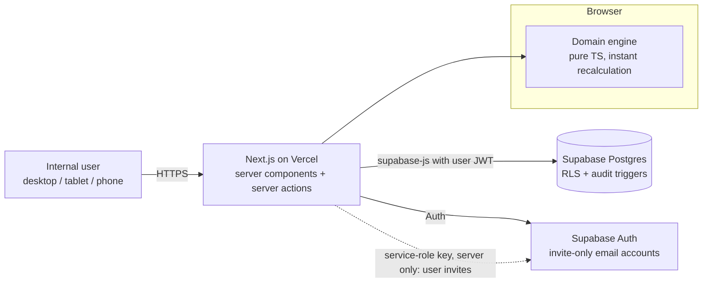
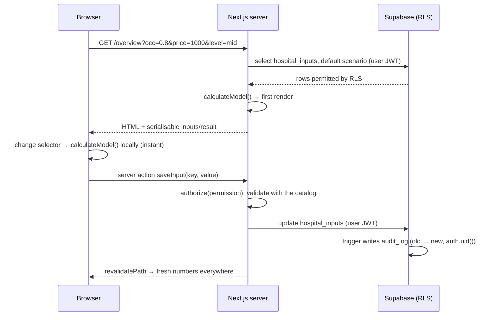

# MVP Architecture — Respiratory Gate Hospital Platform

Status: **implemented (Phase 1 MVP).** Written as the Step 1 proposal and updated where the build changed it. It is built on the verified workbook analysis in `docs/excel-formula-map.md`; the data model is in `docs/database-schema.md`.

## 1. Goal and constraints

Phase 1 is an internal, authenticated web app. It turns the `Elite_RT_Value_Calculator.xlsx` model into live Revenue, Savings and Value Bridge views for Respiratory Gate leadership and authorised hospital staff.

| Constraint | Architectural consequence |
|---|---|
| Weeks, not months | One deployable app with a managed database and auth. No custom backend service, no microservices. |
| Calculation integrity | Pure, typed domain layer; workbook parity tests are a merge gate. |
| No invented data | Tri-state results (`calculated` / `partial` / `missing`). Unknown is `NULL`, never `0`. |
| Financial data, no PHI | Only aggregate operational and financial figures. No patient-level tables, fields or free-text patient data. |
| Grow later (portals, multi-hospital) | `organization_id` on every row, role enum reserved for future roles, deny-by-default RLS, modules separated by boundary. |

Out of scope for Phase 1: patient portal, physician portal, patient records, predictive AI, notifications, WhatsApp, scheduling, advanced BI, multi-hospital tenancy UI, and EHR integration.

## 2. Technology decisions

| Concern | Choice | Why |
|---|---|---|
| App framework | **Next.js (App Router) + TypeScript**, strict mode | One codebase for UI and server actions; server components keep financial data off the client until it is authorised. |
| Styling / components | **Tailwind CSS + shadcn/ui** (Radix primitives) | Accessible primitives; components live in the repo and are themed with brand tokens. |
| Charts | **Plain HTML/CSS** (no chart library) | The matrix, lever bars and horizontal value-bridge waterfall are simple enough to build accessibly by hand; nothing extra to download, and they reflow to phone width. Colours validated for contrast and colour-vision deficiency. |
| Database / auth | **Supabase**: Postgres, Auth, row-level security | Auth, RLS and SQL triggers for audit with no backend to run. |
| Validation | **Catalog-driven parsers** in `src/domain/calculations/validation.ts` | One definition validates the form, the Server Action and the engine input; database constraints repeat the critical rules. |
| Tests | **Vitest** (domain and unit), **Playwright** (one end-to-end smoke path) | Fast parity tests on every push. |
| Hosting | **Vercel** (preview per PR plus production) | No-ops deploys; env vars managed per environment. |
| CI | GitHub Actions: lint, typecheck, unit/parity tests, build | Parity tests block merges. |

Versions: Next.js 16.4 (App Router, Turbopack, `cacheComponents` off because every page is per-user and live), React 19, Tailwind 4, `@supabase/ssr`, Vitest, Playwright. Region: Supabase **eu-central-1 (Frankfurt)** — Supabase has no Middle East or Africa region — with Vercel functions in **fra1** next to it.

## 3. System context



- Reads run with the **signed-in user's JWT**, so RLS is enforced on every query.
- The **service-role key** is used in exactly one place: the server-only admin action that invites users. It is never sent to the browser.
- The calculation engine runs in both places. The server renders the first view; the browser recalculates instantly when scenario controls change. It is pure TypeScript with no dependencies.

## 4. Repository layout and module boundaries

```
/
├─ CLAUDE.md                     primary project instructions
├─ data/                         reference workbook (read-only artifact)
├─ brand/                        original logo files (source assets)
├─ docs/                         formula map, architecture, schema, brief
├─ scripts/workbook/             Python tooling: parity fixture generator
├─ tests/fixtures/               workbook-parity.json (generated)
├─ supabase/
│  ├─ migrations/                SQL migrations (schema, RLS, triggers)
│  ├─ tests/                     RLS / audit tests through the real Auth + Data API
│  └─ seed.sql                   intentionally empty (reference data is a migration)
├─ public/brand/                 web-optimised, trimmed/transparent logos
└─ src/
   ├─ domain/                    ◀ pure TypeScript; imports nothing outside domain/
   │  ├─ inputs/catalog.ts       46 hospital inputs + RG assumptions: key, cell, group, unit, owner, note, validation
   │  ├─ inputs/display.ts       status labels, edit/display formatting
   │  ├─ calculations/
   │  │  ├─ quantity.ts          Quantity type + helpers (calculated / partial / missing)
   │  │  ├─ revenue.ts           occupancy × price matrix, ICU package, other streams, billing leakage
   │  │  ├─ savings.ts           lever baselines, sensitivities, totals
   │  │  ├─ operatingCost.ts     total RT operating cost, contribution margin
   │  │  ├─ valueBridge.ts       bridge steps, totals, net service-line value
   │  │  ├─ validation.ts        hard errors + plausibility warnings
   │  │  ├─ completeness.ts      model-input and all-data completeness
   │  │  └─ index.ts             calculateModel(inputs, assumptions, selection) → ModelResult
   │  ├─ copy/                   guardrail rules, status labels, calculation-basis strings
   │  └─ format.ts               EGP / % / compact number formatting (display only)
   ├─ server/                    data access, authorisation helpers, server actions
   │  ├─ supabase/               typed clients (server, browser, admin)
   │  ├─ repositories/           hospitalInputs, scenarios, audit, profiles
   │  └─ auth/                   getSessionProfile(), requireRole()
   ├─ app/                       routes (see §8)
   └─ components/
      ├─ ui/                     shadcn primitives
      ├─ metrics/                MetricCard (value + basis + status), StatusBadge, CompletenessMeter
      ├─ charts/                 RevenueMatrix, LeverBars, ValueBridgeChart
      ├─ dashboards/             Overview, Revenue, Savings, Bridge, Report views
      ├─ scenario/               ScenarioProvider (live recalculation), ScenarioBar
      └─ layout/                 AppShell, navigation
```

**Boundary rules**, enforced with ESLint `no-restricted-imports`:

- `src/domain/**` must not import React, Next, Supabase, or anything from `server/`, `app/` or `components/`.
- `src/components/**` must not import `server/`. Data arrives as props from route components.
- Only `src/server/**` talks to Supabase.
- Future portals (`app/(physician)`, `app/(patient)`) would be new route groups with their own data-access modules. They would never reuse the financial repositories.

## 5. Calculation engine design

### 5.1 Result type — no fake zeros

```ts
type Quantity =
  | { kind: 'calculated'; value: number; basis: string; inputs: InputKey[] }
  | { kind: 'partial';    value: number; basis: string; inputs: InputKey[]; missing: InputKey[] }
  | { kind: 'missing';    label: StatusLabel; required: InputKey[] };
```

- `calculated`: the workbook computes the same number with all components present.
- `partial`: the workbook computes a number while silently excluding blank components (formula map F1, F4). The UI shows the number with an amber "Partial" badge and names the missing inputs.
- `missing`: the workbook shows a text status. `label` is the workbook's own wording (`Baseline required`, `Scenario pending`, `Data required`, `To be quantified`).
- `basis` is the human-readable calculation, e.g. `50 beds × 80% occupancy × EGP 1,000 × 365 days`. This satisfies the "value + calculation basis + confidence" presentation rule.

### 5.2 Entry point

```ts
calculateModel(
  inputs: HospitalInputs,           // Record<InputKey, number | null>; null = unknown
  assumptions: ModelAssumptions,    // days/month, days/year, occupancy grid, price grid, savings %
  selection: ScenarioSelection,     // occupancy, package price, savings level
): ModelResult                      // revenue matrix, levers, bridge, totals, completeness, warnings
```

Deterministic and side-effect free, so the same function serves the dashboard, the report, the server-rendered first view and the tests.

### 5.3 Parity testing (merge gate)

1. `tests/fixtures/workbook-parity.json` holds 10 LibreOffice-recalculated scenarios: 132 formula cells each, 1,320 expected values.
2. The catalog records each input's workbook cell (e.g. `ventilated_patient_days → Inputs!C8`). The parity test maps each fixture's `cells` into `HospitalInputs`, runs `calculateModel`, and compares every mapped output with its expected workbook cell. Relative tolerance is 1e-9.
3. Hand-written unit tests cover each formula, each partial or missing branch, validation and formatting.
4. Deliberate deviations are tested explicitly. **D1**: blank ICU beds gives `missing('Data required')`, while the fixture records the workbook's `0`.
5. A catalog test asserts that every workbook input cell in the formula map has exactly one catalog key, and vice versa.

The engine becomes the operational source of truth only after this suite passes (`CLAUDE.md`, Excel migration step 7).

### 5.4 Validation

- **Errors** block saving: non-numeric values, negatives, percentages outside 0–100%, non-integer counts.
- **Warnings** are saved but flagged: ventilated patient-days > ICU beds × days per year; an oxygen consumption figure with no unit; collection rate < 50% or tariff = 0 while unbilled activities > 0.
- Missing data is **not** a validation error. It is a completeness state.

## 6. Data flow



- **Scenario controls** (occupancy, price, savings level) live in URL search parameters. That makes them shareable and bookmarkable, and they need no database write. Defaults come from the organisation's default scenario.
- **Saved named scenarios** are a `scenario_assumptions` row. Admins can approve them; approval stores a snapshot of the inputs and results so an approved figure cannot drift silently.

## 7. Access model

| Capability | Admin | Manager / Finance | Viewer | Physician / Patient (reserved) |
|---|---|---|---|---|
| View dashboards and reports | ✓ | ✓ | ✓ | ✗ |
| Edit hospital inputs (`hospital_data`, `verified_public`) | ✓ | ✓ | ✗ | ✗ |
| Edit RG assumptions (grids, days, savings %) | ✓ | ✗ | ✗ | ✗ |
| Save / edit draft scenarios | ✓ | ✓ | ✗ | ✗ |
| Approve scenarios | ✓ | ✗ | ✗ | ✗ |
| Export / print reports | ✓ | ✓ | ✓ (print) | ✗ |
| View audit log | ✓ | ✓ (read) | ✗ | ✗ |
| Manage users and roles | ✓ | ✗ | ✗ | ✗ |

Three layers of enforcement:

1. **Proxy** (`src/proxy.ts`, Next 16's renamed middleware) refreshes the session and redirects signed-out users to `/sign-in`.
2. Every server action calls `requireRole()`.
3. **RLS** in Postgres is the last line of defence; the policies are in `docs/database-schema.md`.

`CLAUDE.md` names Admin as the audit-log role. Read-only audit access for Manager/Finance is implemented so they can see who changed the inputs they own; it is one policy line to remove if the hospital prefers Admin-only.

Accounts are **invite-only**: self sign-up is disabled in Supabase Auth and admins invite users from Settings. Future roles exist only as enum values; no policy grants them anything.

## 8. Screens

Global layout: a sidebar (bottom nav on phones) holding the colour logo and the eight sections; a sticky **Scenario bar** (occupancy · package price · savings level) on Overview, Revenue, Savings, Value Bridge and Reports; and a **data completeness** pill in the header.

| Route | Purpose | Key domain outputs |
|---|---|---|
| `/sign-in` | Email + password | — |
| `/overview` | Executive dashboard: ICU beds, occupancy, selected price, ICU gross potential, quantified savings, operating-cost status, net service-line value, completeness | `ModelResult` headline quantities |
| `/inputs` | Grouped forms: ICU Activity, Unit Costs, Annual Spend, Usage, Equipment, Billing, Other Revenue Streams, RT Operating Cost. Each field shows unit, owner, note, source badge, `Data required` / `Baseline required`, and last-changed-by. | catalog + completeness |
| `/revenue` | Occupancy × price matrix with daily / monthly / annual toggle, selected cell highlighted orange, other streams, contribution margin | `revenue.*`, `operatingCost.*` |
| `/savings` | Low / Mid / High selector, six lever cards (baseline, %, saving, status, missing inputs), overlap warning, undeduplicated total | `savings.*` |
| `/value-bridge` | Waterfall: revenue steps → + cost avoidance → − operating cost → net, with excluded steps listed. No net bar unless operating cost is numeric; "Provisional" if partial. | `valueBridge.*` |
| `/reports` | Printable executive summary, scenario comparison, data-completeness report | all |
| `/audit` | Filterable change history: who, when, field, old → new | `audit_log` |
| `/settings` | Users and roles (Admin), RG assumptions (Admin), organisation profile | — |

Responsive behaviour: the 4 × 3 matrix becomes a stacked card list below the `md` breakpoint; the waterfall becomes a vertical bridge list on phones; all tables scroll horizontally inside their card, never the page.

## 9. Reporting and export

- **Phase 1:** `/reports/executive` is a print-optimised route with an `@media print` stylesheet, A4 layout, the brand header, the guardrail rules and a timestamp. Users save it as PDF from the browser. There is no server-side PDF service.
- **Phase 1.1:** an Excel export that writes the current inputs and selection into a copy of the reference workbook (`exceljs`). Finance can open it in Excel, which doubles as an independent parity check.
- **Deferred:** scheduled email reports and automated physician or patient reporting.

## 10. Brand and UI system

Colours sampled from the logo files and the workbook:

| Token | Hex | Source | Use |
|---|---|---|---|
| `brand-blue` | `#12678D` | logo (the workbook's "Revenue" label uses `#12678C`) | Navigation, primary actions, trusted information. 6.3:1 contrast on white. |
| `brand-orange` | `#E67F23` | logo | Selected scenario, highlights, opportunity. **Fills and large numerals only** (2.8:1 on white). |
| `brand-orange-text` | ≈ `#A65410` | darkened orange, ≈ 5.4:1 (the workbook's `#B85F12` is 4.49:1, just short of AA) | Orange text and links; verify ≥ 4.5:1 at build. |
| `ink` | `#0F2340` | workbook headers | Primary text, headings |
| `muted` | `#5E6B78` | workbook notes | Secondary text |
| `surface` | off-white (≈ `#F7F8FA`) | — | Page background |
| `success` / `warning` / `danger` | green / amber / red | `CLAUDE.md` | Confirmed positive / incomplete / error only |

- Typography: a neutral sans with **tabular numerals** for every money figure (e.g. Inter or IBM Plex Sans). Large, confident headline numbers on metric cards.
- **Logo assets.** All four originals have opaque backgrounds and the monochrome mark is only about 160 × 117 px. `scripts/brand/prepare_logos.py` generates trimmed, transparent web versions in `public/brand/` and the app icons; originals stay in `brand/`. **Request vector (SVG) originals from the brand owner.**
- Usage: the colour square logo in the sidebar and on sign-in (primary identity). The monochrome mark is only for dark surfaces, a subtle print watermark, or compact secondary branding.
- Internationalisation: English first. Strings are centralised and Tailwind uses logical properties (`ms-`, `pe-`), so Arabic/RTL can be added without a rewrite.

## 11. Security, privacy and compliance

- **No PHI in Phase 1.** The schema has no patient entities. Free-text fields (`text_value`, scenario names) show "Do not enter patient information". A schema-review checklist item blocks any patient-level column.
- **Secrets** come only from environment variables. `.env.example` documents `NEXT_PUBLIC_SUPABASE_URL`, `NEXT_PUBLIC_SUPABASE_ANON_KEY` and `SUPABASE_SERVICE_ROLE_KEY` (server only). Nothing secret is committed.
- **RLS on every table**, deny by default; the audit log is append-only and written only by triggers.
- **Transport and storage**: HTTPS everywhere (Vercel); Supabase encrypts at rest. Backup and point-in-time-recovery availability depends on the Supabase plan; confirm before go-live.
- **Hosting region / data residency.** Supabase eu-central-1 (Frankfurt) and Vercel fra1 — Supabase offers no Middle East or Africa region. Phase 1 holds no PHI, but user accounts (names, emails) are personal data under Egypt's Personal Data Protection Law (Law No. 151 of 2020); hospital IT and legal should confirm the region before production data is entered.
- **Before any PHI** is introduced, the `CLAUDE.md` gate applies: hosting and residency, encryption, audit, backup and retention, access policies, local regulation, and hospital legal/IT sign-off.

## 12. Testing and quality gates

| Layer | Tool | Gate |
|---|---|---|
| Domain parity (fixtures) | Vitest | Required to merge |
| Domain unit (branches, validation, formatting) | Vitest | Required to merge |
| Catalog ↔ workbook mapping | Vitest | Required to merge |
| Lint (incl. boundary rules), typecheck | ESLint, `tsc --noEmit` | Required to merge |
| End-to-end smoke: sign in → edit input → recalculated bridge → audit row → print view | Playwright against a local Supabase | Required before release |
| RLS policy tests (role × table × operation) | SQL tests (pgTAP or a scripted matrix) | Required before release |

## 13. Environments and deployment

- **Local:** `pnpm db:start` (Supabase in Docker, migrations applied), `pnpm db:env`, `pnpm user:create`, `pnpm dev`. The organisation and catalog rows come from the reference-data migration with all hospital values `NULL`.
- **Preview:** a Vercel preview per pull request against a non-production Supabase project.
- **Production:** a Vercel production deployment plus a production Supabase project. Migrations are applied through the Supabase CLI in CI or manually by an admin.
- Seed data never contains invented hospital values. The only seeded number is ICU beds = 50, sourced from the hospital's public website, plus the workbook's RG assumption defaults.

## 14. Delivery plan (mapped to `CLAUDE.md` steps)

| Milestone | Scope | Target |
|---|---|---|
| ✅ Step 1 | Workbook analysis, parity fixtures, architecture, schema | done |
| ✅ Step 2 | Next.js 16 / TypeScript / Tailwind scaffold, app shell, navigation, Supabase auth, brand tokens, logo prep | done |
| ✅ Step 3 | Domain engine + parity and unit tests green | done |
| ✅ Step 4 | Inputs UI with validation and completeness | done |
| ✅ Step 5 | Overview, Revenue, Savings, Value Bridge connected to the engine; charts | done |
| ✅ Step 6 | Supabase schema, RLS, audit triggers, roles, user management, saved/approved scenarios | done |
| ✅ Step 7 | Executive report and print view, responsive layout, Playwright end-to-end suite, CI | done |
| Next | Production Supabase + Vercel setup, hospital data entry, Phase 1.1 Excel export | — |

Steps 2 and 3 can run in parallel because the engine has no UI dependency.

## 15. Risks and open decisions

| Risk / decision | Mitigation / owner |
|---|---|
| Overlapping levers overstate cost avoidance (Rule 4) | Show levers individually, label the total "undeduplicated", resolve Q2 with Finance |
| Partial operating cost makes the net value look like profit (F4) | `partial` status, "Provisional" badge, report wording; Finance enters 0 for lines that do not apply |
| Package price and 100% uptake are commercial assumptions (Rule 2, F14) | Basis text and guardrail copy on every revenue figure; Q1 |
| Hosting region / PDPL compliance | Frankfurt chosen (no MENA region on Supabase); confirm with hospital IT and legal before production data |
| LibreOffice vs Excel recalculation differences | Functions used are standard; Finance spot-checks one populated scenario in Excel |
| Low-resolution / raster-only logo files | Interim trimmed PNGs; request SVG originals |
| Scope creep toward portals | Phase 1 boundary in `CLAUDE.md`; reserved roles only |
